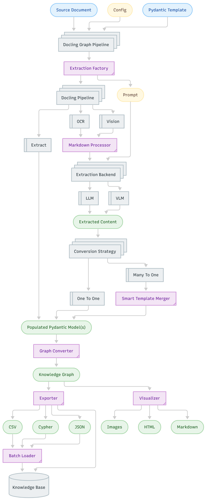

<p align="center"><br>
  <a href="https://github.com/ayoub-ibm/docling-graph">
    
  </a>
</p>

# Docling Graph

[](https://github.com/ayoub-ibm/docling-graph)
[](https://github.com/docling-project/docling)
[](https://www.python.org/downloads/)
[](https://pydantic.dev)
[](https://networkx.org/)

[](https://typer.tiangolo.com/)
[](https://docs.pytest.org/)
[](https://github.com/Textualize/rich)
[](https://mistral.ai/)
[](https://ollama.ai/)
[](https://opensource.org/licenses/MIT)
[](https://lfaidata.foundation/projects/)

Docling-Graph converts documents into validated **Pydantic** objects and then into a **directed knowledge graph**, with exports to CSV or Cypher and both static and interactive visualizations.  

The toolkit supports two extraction families: **local VLM** via Docling and **LLM-based extraction** via local (Ollama) or API providers (Mistral, OpenAI, Gemini), all orchestrated by a flexible, config-driven pipeline.


## Design Philosophy

- **Separation of Concerns**: Decouples processing granularity, model family, and inference site.
- **Typed, Validated Outputs**: Uses Pydantic models with stable node IDs driven by optional `graph_id_fields`.
- **Modular Architecture**: Graph module with clean separation (`core`, `exporters`, `visualizers`, `utils`).
- **Robust Fallbacks**: Supports long documents with merging strategies, clear logs, Markdown reports, and exportable graphs (`CSV`, `JSON` or `Cypher`) for batch imports.


## Key Capabilities

- **Extraction**:
  - Local `VLM` (Docling's vision pipeline leveraging Granite-Docling)  
  - `LLM` (local via Ollama or remote via Mistral/OpenAI/Gemini API)  
  - Page-wise or whole-document conversion strategies
- **Graph Construction**:
  - Markdown to Graph: Convert validated Pydantic instances to a `NetworkX DiGraph` with rich edge metadata and stable node IDs
  - Smart Merge: Combine multi-page documents into a single Pydantic instance for unified processing
  - Modular graph module with enhanced type safety and configuration
- **Export**:
  - `CSV` compatible with `Neo4j` admin import  
  - `Cypher` script generation for bulk ingestion
  - `JSON` export for general-purpose graph data
- **Visualization**:
  - Interactive `CosmoGraph HTML` visualization in full-page browser view with enhanced node/edge exploration
  - Publication-grade static images (`PNG`, `SVG`, `PDF`)
  - Detailed `MARKDOWN` report with graph nodes content and edges


## Docling Graph Workflow

Docling Graph provides an automated pipeline that transforms unstructured documents into structured, validated data and graph representations.

It integrates `document conversion`, data `extraction via LLMs & VLMs`, `schema validation`, and `graph construction`, enabling flexible export and interactive visualization of complex document relationships.

<p align="center"><br>
  
</p>

## Installation

Requirements:

- **Python >= 3.10** 

Clone and install:
```bash
git clone https://github.com/ayoub-ibm/docling-graph
cd docling-graph
pip install -e .
```

Dependencies:

- Core: `docling[vlm]`, `pydantic`, `networkx`, `pymupdf`, `matplotlib`, `cosmograph`, `ipywidgets`, `rich`, `typer`
- Optional LLM clients: `ollama` (local), `mistralai`, `openai`, `google-generativeai` (remote)


## Quick Start

### 1. Initialize Configuration

```bash
docling-graph init
```

The interactive wizard will walk you through:
- **Processing Mode** – Choose between `one-to-one` (page-by-page) or `many-to-one` (entire document) processing  
- **Backend Type** – Select `llm` (Language Model) or `vlm` (Vision-Language Model) for extraction  
- **Inference Location** – Choose `local` (your machine) or `remote` (cloud APIs)  
- **Export Format** – Select `csv`, `json` or `cypher` for knowledge graph output  
- **Docling Pipeline** – Choose document processing pipeline (`ocr`, or `vision`)  
- **Model Configuration** – Select specific models based on your backend and inference choices  
- **Output Settings** – Configure output directory and visualization preferences  

Each option includes helpful descriptions and sensible defaults.


### 2. Run Conversion (CLI)

```bash
docling-graph convert <SOURCE> --template "<TEMPLATE_PATH>" [OPTIONS]
```


## CLI Commands

### 1. Convert Command

Converts documents into knowledge graphs with full extraction and export capabilities.

#### 1.1. Required Options

- `--template, -t` : Dotted path to Pydantic template (e.g., `examples.templates.invoice.Invoice`)

#### 1.2. Optional Dimensions

- `--processing-mode, -p` : `one-to-one` | `many-to-one`  
- `--backend_type, -b` : `llm` | `vlm`  
- `--inference, -i` : `local` | `remote`  
- `--docling-config, -d` : `default` (OCR) | `vision` (VLM pipeline)  
- `--output-dir, -o` : Output directory (default: `outputs`)  
- `--model` : Override model name  
- `--provider` : Override provider  
- `--export-format, -e` : `csv` | `json` | `cypher`  
- `--reverse-edges` : Add reverse edges to graph

#### 1.3. Convert Examples

**Local VLM (one-to-one), VLM docling pipeline:**
```bash
docling-graph convert examples/data/invoice.pdf \
  --template "examples.templates.invoice.Invoice" \
  -p one-to-one -b vlm -i local -d vision -o outputs
```

**Local LLM via Ollama (many-to-one), default OCR pipeline:**
```bash
docling-graph convert examples/data/policy.pdf \
  --template "examples.templates.insurance.InsuranceTerms" \
  -p many-to-one -b llm -i local \
  --provider ollama --model "llama3:8b-instruct" \
  -d default -o outputs
```

**API LLM via Mistral (many-to-one):**
```bash
export MISTRAL_API_KEY="your_api_key_here"
docling-graph convert examples/data/invoice.png \
  --template "examples.templates.invoice.Invoice" \
  -p many-to-one -b llm -i remote \
  --provider mistral -o outputs
```

**With reverse edges:**
```bash
docling-graph convert examples/data/invoice.pdf \
  --template "examples.templates.invoice.Invoice" \
  -p one-to-one -b vlm -i local \
  --reverse-edges -o outputs
```


### 2. Inspect Command


Visualizes existing graph data using CosmoGraph in an interactive browser interface. This command creates a self-contained HTML file that can be opened, shared, or saved for later viewing.

#### 2.1. Arguments

- `PATH` : Path to graph data
  - For **CSV format**: Directory containing `nodes.csv` and `edges.csv`
  - For **JSON format**: Path to `.json` file

#### 2.2. Options

- `--format, -f` : Import format (`csv` or `json`, default: `csv`)
- `--output, -o` : Output HTML file path (default: temporary file)
- `--open/--no-open` : Automatically open in browser (default: `--open`)

#### 2.3. Inspect Examples

**Visualize CSV graph data (opens in browser automatically):**
```bash
docling-graph inspect ./outputs
```

**Visualize JSON format:**
```bash
docling-graph inspect graph.json --format json
```

**Save to specific location:**
```bash
docling-graph inspect ./outputs --output graph_visualization.html
```

**Create HTML without opening browser:**
```bash
docling-graph inspect ./outputs --no-open --output viz.html
```

**Inspect previously exported graph:**
```bash
# After running convert, inspect the output
docling-graph convert invoice.pdf --template "examples.templates.invoice.Invoice" -o outputs
docling-graph inspect outputs
```


## Python API Usage

### 1. Basic Example

```python
from pathlib import Path
from docling_graph.pipeline import run_pipeline

# Define configuration
config = {
    "source": "examples/data/invoice.pdf",
    "template": "examples.templates.invoice.Invoice",
    "processing_mode": "one-to-one",
    "backend_type": "vlm",
    "inference": "local",
    "docling_config": "vision",
    "output_dir": "outputs",
    "export_format": "csv",
    "reverse_edges": False,
    "config": {
        "models": {
            "vlm": {
                "local": {
                    "default_model": "numind/NuExtract-2.0-8B",
                    "provider": "docling"
                }
            }
        }
    }
}

# Run the pipeline
run_pipeline(config)
```

### 2. Advanced: Direct Graph Module Usage

```python
from docling_graph.graph import (
    GraphConverter,
    GraphConfig,
    CSVExporter,
    CypherExporter,
    JSONExporter,
    CosmoGraphVisualizer,
)
from examples.templates.invoice import Invoice
from pathlib import Path

# 1. Create and validate Pydantic model
invoice = Invoice(
    bill_no="INV-001",
    date="2024-01-15",
    total=1500.00,
    # ... other fields
)

# 2. Convert to graph
config = GraphConfig(
    add_reverse_edges=True,
    node_id_hash_length=12
)
converter = GraphConverter(config=config)
graph = converter.convert([invoice])

# 3. Export to different formats
output_dir = Path("outputs")

# CSV Export (Neo4j compatible)
csv_exporter = CSVExporter()
csv_exporter.export(graph, output_dir / "nodes.csv", output_dir / "edges.csv")

# JSON Export
json_exporter = JSONExporter()
json_exporter.export(graph, output_dir / "graph.json")

# Cypher Export
cypher_exporter = CypherExporter()
cypher_exporter.export(graph, output_dir / "graph.cypher")

# 4. Create visualizations
# Generate markdown report
report_gen = ReportGenerator()
report_gen.visualize(
    graph,
    output_path=output_dir / "graph_report.md",
    source_model_count=1
)

# Interactive CosmoGraph visualization (HTML)
cosmo_viz = CosmoGraphVisualizer()
cosmo_viz.visualize(
    graph,
    output_path=output_dir / "graph_interactive",
    open_browser=True  # Opens visualization in browser
)
```

### 3. Working with NetworkX Directly

```python
import networkx as nx
from docling_graph.graph import GraphConverter

# Convert to graph
converter = GraphConverter()
graph = converter.convert([invoice])

# Access NetworkX graph
print(f"Nodes: {graph.number_of_nodes()}")
print(f"Edges: {graph.number_of_edges()}")

# Query nodes
for node_id, data in graph.nodes(data=True):
    print(f"Node: {node_id}, Label: {data.get('label')}")

# Query edges
for source, target, data in graph.edges(data=True):
    print(f"Edge: {source} -> {target}, Type: {data.get('label')}")

# NetworkX analysis
print(f"Average degree: {sum(dict(graph.degree()).values()) / graph.number_of_nodes()}")
```

### 4. Custom Configuration

```python
from docling_graph.graph import GraphConfig, VisualizationConfig

# Graph configuration
graph_config = GraphConfig(
    add_reverse_edges=True,
    node_id_hash_length=16,  # Longer hash for IDs
    edge_metadata_fields=['source', 'target', 'label']
)

# Visualization configuration
viz_config = VisualizationConfig(
    # Static visualization
    static_figure_size=(30, 24),
    static_node_size=5000,
    static_node_color='#FF6B6B',
    
    # Interactive visualization
    interactive_height="900px",
    interactive_width="100%"
)

# Use configurations
converter = GraphConverter(config=graph_config)
visualizer = StaticVisualizer(config=viz_config)
```


## Pydantic Templates

Templates define the schema for extraction and graph structure:

- Available templates: **invoices**, **French ID cards**, **insurance terms**
- Edges can be **implicit** (nested BaseModels) or **explicit** (generic Edge type)

### Tips

- Use `model_config.graph_id_fields` for natural keys to ensure stable, readable node IDs
- Include examples and descriptions on fields for better LLM extraction
- Leverage `is_entity=True` in model_config to create nodes
- Use `Edge()` helper for explicit relationship definition

**Example:**

```python
from pydantic import BaseModel, Field
from typing import Optional

class Person(BaseModel):
    """Person entity with stable ID based on name and DOB."""
    model_config = {
        'is_entity': True,
        'graph_id_fields': ['last_name', 'date_of_birth']
    }
    
    first_name: str = Field(description="Person's first name")
    last_name: str = Field(description="Person's last name")
    date_of_birth: str = Field(description="Date of birth (YYYY-MM-DD)")
```

For complete guidance, see: [Pydantic Templates for Knowledge Graph Extraction](docs/guides/pydantic_templates_for_knowledge_graph_extraction.md)


## Environment and Providers

### Local LLM (Ollama)
```bash
# Start Ollama service
ollama serve

# Pull a model
ollama pull llama3:8b-instruct
```

### API Providers

API keys for LLM providers can also be set in the `.env` file.

**Mistral:**
```bash
export MISTRAL_API_KEY="your_api_key_here"
# or add to .env file
```

**OpenAI:**
```bash
export OPENAI_API_KEY="your_api_key_here"
```

**Google Gemini:**
```bash
export GEMINI_API_KEY="your_api_key_here"
```

### Local VLM (via Docling)

Specify HuggingFace model ID:
```yaml
vlm:
  local:
    default_model: "numind/NuExtract-2.0-8B"
    provider: "docling"
```


## Troubleshooting

- **Config not found**: Run `docling-graph init`
- **VLM with API not supported**: Use `--inference local` or `--backend_type llm`
- **Template import failed**: Verify the dotted path and ensure the module is accessible
- **Ollama connection error**: Ensure service is running (`ollama serve`) and model is pulled
- **API key not set**: Export API key environment variable or add to `.env` file
- **Empty LLM responses**: Check prompt configuration and model compatibility
- **Graph visualization issues**: Ensure matplotlib, cosmograph, and ipywidgets are installed (`pip install cosmograph ipywidgets`)
- **CosmoGraph browser issues**: If visualization doesn't open, manually open the generated HTML file
- **Node ID format issues**: Check that `graph_id_fields` values are properly set


## Roadmap & R&D Directions

This section outlines the upcoming priorities and development directions for the project, organized by timeline and focus area.

### 1. Immediate Priorities

- **[High] CI/CD Integration:** Set up continuous integration and deployment pipelines using `GitHub Actions`.
- **[High] Test Coverage Expansion:** Extend unit and integration tests across the entire codebase.
- **[Medium] Security & Validation Enhancements:** Add robust input validation (file paths, recursion depth, model size limits, rate limiting).
- **[Medium] Performance Improvements:** Implement caching, asynchronous processing, and batch operations for faster inference.


### 2. Upcoming Features

* **Multi-LLM Support:** Extend provider compatibility to include `WatsonX`, `vLLM`, and other clients.
* **Flexible Input Modalities:** Support `text`, `markdown`, and direct `DoclingDocument` inputs.
* **Adaptive OCR Pipeline:** Use Hugging Face’s [XGB classifier](https://github.com/huggingface/finepdfs?tab=readme-ov-file#ocr-vs-noocr-classifier) to automatically choose the appropriate Docling conversion path.
* **Graph Database Integration:** Enable direct graph loading into `Neo4j`, `ArangoDB`, and similar systems.
* **CLI Graph Queries:** Add a `docling-graph query` command to query generated graphs (e.g., with LangChain).
* **Customizable Components:** Allow user-defined module overrides and flexible component instantiation.
* **Interactive Template Builder:** Create guided, interactive workflows for generating Pydantic templates.
* **Optimized Batch Processing:** Improve GPU-based local inference batching and memory utilization.
* **Persistent Markdown Storage:** Cache and reuse intermediate Markdown outputs from the Docling converter.


### 3. Research & Development Ideas

* **Smart Chunking:** Replace naive context-window splitting with Docling’s structure-aware chunking to preserve logical document relationships (lists, tables, etc.).
* **Ontology-Based Template Matching:** Use semantic similarity and ontology mapping to automatically select the most relevant Pydantic template for extraction.
* **Graph Docling Conversion:** Leverage *Docling Graph* to transform datasets such as [FinePDFs](https://huggingface.co/datasets/HuggingFaceFW/finepdfs) or [DocLayNet v1.2](https://huggingface.co/datasets/ds4sd/DocLayNet-v1.2) into paired `document–knowledge graph datasets`, enabling direct doc → knowledge graph model training (bypassing intermediate Pydantic layers).


## License

MIT License - see [LICENSE](LICENSE) for details.


## Acknowledgments

- Built on [Docling](https://github.com/docling-project/docling) for document processing
- Uses [Pydantic](https://pydantic.dev) for data validation
- Graph powered by [NetworkX](https://networkx.org/)
- Visualizations with [Matplotlib](https://matplotlib.org/) and [Cosmograph](https://cosmograph.app/)
- CLI powered by [Typer](https://typer.tiangolo.com/) and [Rich](https://github.com/Textualize/rich)
