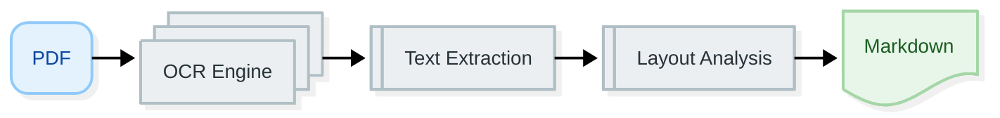
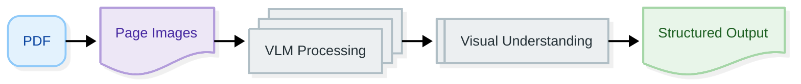

# Docling Settings

**Navigation:** [← Processing Modes](processing-modes.md) | [Next: Export Configuration →](export-configuration.md)

---

## Overview

Docling settings control how documents are converted before extraction. Docling Graph uses the Docling library to convert PDFs and images into structured formats (markdown or JSON) that can be processed by LLMs or VLMs.

**In this guide:**
- OCR vs Vision pipeline
- Export options
- Pipeline selection
- Performance considerations
- Troubleshooting

---

## Docling Pipeline Types

### Quick Comparison

| Aspect | OCR Pipeline | Vision Pipeline |
|:-------|:------------|:----------------|
| **Method** | Traditional OCR | Vision-Language Model |
| **Speed** | Fast | Slower |
| **Accuracy** | Good for standard docs | Best for complex layouts |
| **GPU Required** | No | Yes |
| **Best For** | Text-heavy documents | Complex visual layouts |
| **Default** | Yes | No |

---

## OCR Pipeline

### What is OCR Pipeline?

The OCR pipeline uses **traditional Optical Character Recognition** to extract text from documents. It's fast, accurate for standard documents, and doesn't require a GPU.

### Configuration

```python
from docling_graph import PipelineConfig

config = PipelineConfig(
    source="document.pdf",
    template="my_templates.Invoice",
    docling_config="ocr"  # OCR pipeline (default)
)
```

### How It Works



### When to Use OCR

✅ **Use OCR when:**
- Documents are text-heavy
- Layout is standard (invoices, contracts, reports)
- Speed is important
- GPU is not available
- Documents are high-quality scans
- Cost efficiency is a priority

❌ **Don't use OCR when:**
- Documents have complex visual layouts
- Tables have intricate structures
- Handwriting needs processing
- Images contain critical information
- Document quality is poor

### OCR Advantages

1. **Fast Processing**
   - Quick text extraction
   - No GPU required
   - Efficient for batch processing

2. **Good Accuracy**
   - Excellent for standard documents
   - Reliable text extraction
   - Handles most layouts well

3. **Low Resource Usage**
   - CPU-only processing
   - Lower memory requirements
   - No special hardware needed

### OCR Limitations

1. **Layout Challenges**
   - May struggle with complex tables
   - Can miss visual relationships
   - Limited understanding of structure

2. **Quality Dependent**
   - Poor scans reduce accuracy
   - Handwriting not well supported
   - Image quality matters

---

## Vision Pipeline

### What is Vision Pipeline?

The Vision pipeline uses **Vision-Language Models** (VLMs) to understand documents visually. It processes layout, structure, and visual relationships alongside text.

### Configuration

```python
from docling_graph import PipelineConfig

config = PipelineConfig(
    source="document.pdf",
    template="my_templates.Invoice",
    docling_config="vision"  # Vision pipeline
)
```

### How It Works



### When to Use Vision

✅ **Use Vision when:**
- Documents have complex layouts
- Tables have intricate structures
- Visual relationships are important
- Forms have specific patterns
- Highest accuracy is required
- GPU is available

❌ **Don't use Vision when:**
- Documents are simple text
- Speed is critical
- GPU is not available
- Cost is a major concern
- Processing large batches

### Vision Advantages

1. **Visual Understanding**
   - Processes layout and structure
   - Understands visual relationships
   - Handles complex tables
   - Better with forms

2. **Higher Accuracy**
   - Best for complex documents
   - Understands context visually
   - Fewer extraction errors
   - Better table handling

3. **Robust to Quality**
   - Handles poor scans better
   - Works with handwriting
   - Processes images directly

### Vision Limitations

1. **Resource Intensive**
   - Requires GPU
   - Higher memory usage
   - Slower processing
   - More expensive hardware

2. **Setup Complexity**
   - GPU drivers required
   - Model downloads needed
   - More configuration

---

## Export Options

### Docling Document Export

```python
config = PipelineConfig(
    source="document.pdf",
    template="my_templates.Invoice",
    
    # Docling export settings
    export_docling=True,  # Export Docling document (default)
    export_docling_json=True,  # Export as JSON (default)
    export_markdown=True,  # Export as markdown (default)
    export_per_page_markdown=False  # Export per-page markdown
)
```

### Export Options Explained

#### 1. export_docling

Controls whether to export the Docling document object.

```python
export_docling=True  # Default
```

**Output:** `outputs/docling_document.pkl` (Python pickle)

#### 2. export_docling_json

Exports the full Docling document structure as JSON.

```python
export_docling_json=True  # Default
```

**Output:** `outputs/docling_document.json`

**Contains:**
- Document metadata
- Layout information
- Tables and figures
- Text content
- Page structure

#### 3. export_markdown

Exports the document as markdown (full document).

```python
export_markdown=True  # Default
```

**Output:** `outputs/document.md`

**Best for:**
- Human-readable output
- Documentation
- Text analysis
- Debugging

#### 4. export_per_page_markdown

Exports markdown for each page separately.

```python
export_per_page_markdown=False  # Default
```

**Output:** `outputs/pages/page_001.md`, `page_002.md`, etc.

**Best for:**
- Page-by-page analysis
- One-to-one processing
- Page-level debugging

---

## Complete Configuration Examples

### Example 1: OCR with Full Exports

```python
config = PipelineConfig(
    source="invoice.pdf",
    template="my_templates.Invoice",
    
    # OCR pipeline
    docling_config="ocr",
    
    # Export everything
    export_docling=True,
    export_docling_json=True,
    export_markdown=True,
    export_per_page_markdown=True
)
```

### Example 2: Vision with Minimal Exports

```python
config = PipelineConfig(
    source="complex_form.pdf",
    template="my_templates.Form",
    
    # Vision pipeline
    docling_config="vision",
    
    # Minimal exports (save space)
    export_docling=False,
    export_docling_json=False,
    export_markdown=False,
    export_per_page_markdown=False
)
```

### Example 3: OCR with Page-Level Exports

```python
config = PipelineConfig(
    source="batch_invoices.pdf",
    template="my_templates.Invoice",
    
    # OCR pipeline
    docling_config="ocr",
    
    # Page-level exports for one-to-one processing
    processing_mode="one-to-one",
    export_per_page_markdown=True,
    export_markdown=False  # Don't need full document
)
```

---

## Pipeline Selection Strategy

### By Document Type

| Document Type | Recommended Pipeline | Reason |
|:--------------|:--------------------|:-------|
| **Invoices** | OCR | Standard layout, text-heavy |
| **Contracts** | OCR | Text-heavy, standard format |
| **Research Papers** | OCR | Text-heavy, standard layout |
| **Forms** | Vision | Visual structure important |
| **ID Cards** | Vision | Visual layout critical |
| **Complex Tables** | Vision | Visual structure needed |
| **Handwritten** | Vision | Visual processing required |
| **Mixed Content** | Vision | Images and text combined |

### By Quality

```python
def get_docling_config(scan_quality: str):
    """Choose pipeline based on scan quality."""
    if scan_quality == "high":
        return "ocr"  # OCR works well
    elif scan_quality == "medium":
        return "ocr"  # OCR still acceptable
    else:
        return "vision"  # Vision better for poor quality
```

### By Infrastructure

```python
def get_docling_config(has_gpu: bool):
    """Choose pipeline based on available hardware."""
    if has_gpu:
        return "vision"  # Can use vision
    else:
        return "ocr"  # Must use OCR
```

---

## Performance Comparison

### Processing Speed

```
Document: 10-page invoice PDF

OCR Pipeline:         ~10 seconds
Vision Pipeline:      ~60 seconds
```

### Accuracy Comparison

```
Document Type: Complex invoice with tables

OCR Accuracy:   92% field extraction
Vision Accuracy: 97% field extraction

Document Type: Simple text contract

OCR Accuracy:   98% field extraction
Vision Accuracy: 96% field extraction
```

### Resource Usage

```
OCR Pipeline:
- CPU: 50-70%
- Memory: 2-4GB
- GPU: Not required

Vision Pipeline:
- CPU: 30-40%
- Memory: 6-8GB
- GPU: Required (4-8GB VRAM)
```

---

## Combining with Backend Settings

### OCR + LLM Backend

```python
# Most common combination
config = PipelineConfig(
    source="document.pdf",
    template="my_templates.Invoice",
    
    # OCR for conversion
    docling_config="ocr",
    
    # LLM for extraction
    backend="llm",
    inference="remote"
)
```

### Vision + VLM Backend

```python
# Highest accuracy combination
config = PipelineConfig(
    source="complex_document.pdf",
    template="my_templates.Form",
    
    # Vision for conversion
    docling_config="vision",
    
    # VLM for extraction
    backend="vlm",
    inference="local"
)
```

### OCR + VLM Backend

```python
# Mixed approach (less common)
config = PipelineConfig(
    source="document.pdf",
    template="my_templates.Invoice",
    
    # OCR for conversion (faster)
    docling_config="ocr",
    
    # VLM for extraction (higher accuracy)
    backend="vlm",
    inference="local"
)
```

---

## Troubleshooting

### Issue: Poor OCR Quality

**Symptoms:** Missing text, garbled characters

**Solutions:**
```python
# 1. Try vision pipeline
config = PipelineConfig(
    source="poor_scan.pdf",
    template="my_templates.Invoice",
    docling_config="vision"  # Better for poor quality
)

# 2. Pre-process document (external tool)
# - Increase resolution
# - Enhance contrast
# - Deskew pages
```

### Issue: Vision Pipeline Too Slow

**Symptoms:** Long processing times

**Solutions:**
```python
# 1. Use OCR if acceptable
config = PipelineConfig(
    source="document.pdf",
    template="my_templates.Invoice",
    docling_config="ocr"  # Faster
)

# 2. Process fewer pages
# 3. Use more powerful GPU
```

### Issue: Missing Tables

**Symptoms:** Table data not extracted

**Solutions:**
```python
# Use vision pipeline for better table handling
config = PipelineConfig(
    source="document_with_tables.pdf",
    template="my_templates.Invoice",
    docling_config="vision"  # Better table extraction
)
```

---

## Best Practices

### 1. Start with OCR

```python
# ✅ Good - Start with faster option
config = PipelineConfig(
    source="document.pdf",
    template="my_templates.Invoice",
    docling_config="ocr"  # Try OCR first
)

# If accuracy insufficient, switch to vision
```

### 2. Match Pipeline to Document

```python
# ✅ Good - Choose based on document type
if document_has_complex_layout:
    docling_config = "vision"
else:
    docling_config = "ocr"

config = PipelineConfig(
    source="document.pdf",
    template="my_templates.Invoice",
    docling_config=docling_config
)
```

### 3. Enable Appropriate Exports

```python
# ✅ Good - Export what you need
config = PipelineConfig(
    source="document.pdf",
    template="my_templates.Invoice",
    docling_config="ocr",
    
    # Enable useful exports
    export_markdown=True,  # For debugging
    export_docling_json=False,  # Don't need full structure
    export_per_page_markdown=False  # Not doing page-level
)
```

---

## Next Steps

Now that you understand Docling settings:

1. **[Export Configuration →](export-configuration.md)** - Configure output formats
2. **[Configuration Examples](configuration-examples.md)** - Complete scenarios
3. **[Model Configuration](model-configuration.md)** - Model settings

---

## Quick Reference

### OCR Pipeline (Default)

```python
config = PipelineConfig(
    source="document.pdf",
    template="my_templates.Invoice",
    docling_config="ocr"
)
```

**Best for:** Standard documents, speed, no GPU

### Vision Pipeline

```python
config = PipelineConfig(
    source="document.pdf",
    template="my_templates.Invoice",
    docling_config="vision"
)
```

**Best for:** Complex layouts, highest accuracy, GPU available

### Export Settings

```python
export_docling=True           # Export Docling document
export_docling_json=True      # Export as JSON
export_markdown=True          # Export as markdown
export_per_page_markdown=False # Export per-page markdown
```

---

**Navigation:** [← Processing Modes](processing-modes.md) | [Next: Export Configuration →](export-configuration.md)