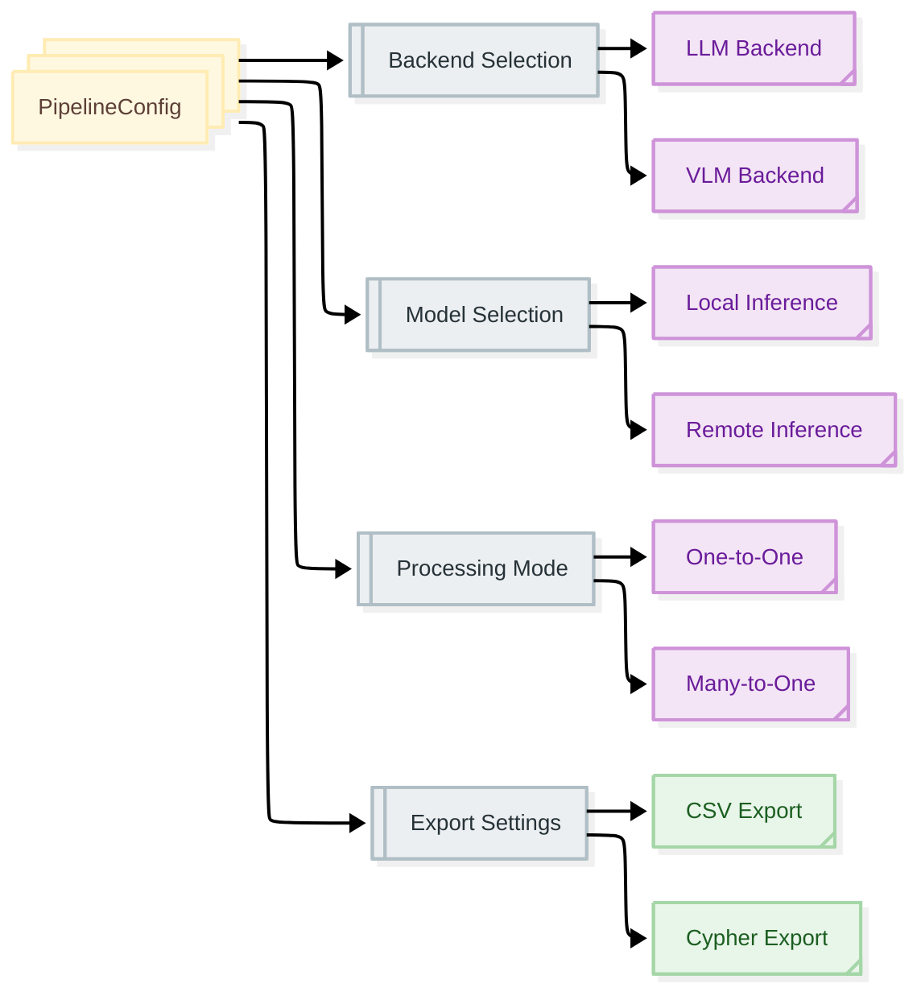

# Pipeline Configuration

**Navigation:** [← Schema Definition](../03-schema-definition/best-practices.md) | [Next: Configuration Basics →](configuration-basics.md)

---

## Overview

Pipeline configuration controls how Docling Graph processes documents and extracts knowledge graphs. The `PipelineConfig` class provides a type-safe, programmatic way to configure all aspects of the extraction pipeline.

**In this section:**
- Understanding PipelineConfig
- Backend selection (LLM vs VLM)
- Model configuration
- Processing modes
- Export settings
- Advanced configuration

---

## What is Pipeline Configuration?

Pipeline configuration defines:

1. **What to extract** - Source document and template
2. **How to extract** - Backend, model, and processing mode
3. **How to process** - Chunking, consolidation, and validation
4. **What to export** - Output formats and locations

### Configuration Methods

You can configure the pipeline in three ways:

#### 1. Python API (Recommended)

```python
from docling_graph import PipelineConfig

config = PipelineConfig(
    source="document.pdf",
    template="my_templates.Invoice",
    backend="llm",
    inference="remote",
    output_dir="outputs"
)

config.run()
```

#### 2. CLI with Flags

```bash
uv run docling-graph convert document.pdf \
    --template "my_templates.Invoice" \
    --backend llm \
    --inference remote \
    --output-dir outputs
```

#### 3. YAML Configuration File

```yaml
# config.yaml
defaults:
  backend: llm
  inference: remote
  processing_mode: many-to-one
  export_format: csv

models:
  llm:
    remote:
      default_model: "mistral-small-latest"
      provider: "mistral"
```

---

## Section Contents

| Document | Description | Time |
|:---------|:------------|:-----|
| **[Configuration Basics](configuration-basics.md)** | PipelineConfig fundamentals and required settings | 15 min |
| **[Backend Selection](backend-selection.md)** | Choosing between LLM and VLM backends | 15 min |
| **[Model Configuration](model-configuration.md)** | Configuring models for local and remote inference | 20 min |
| **[Processing Modes](processing-modes.md)** | One-to-one vs many-to-one extraction | 15 min |
| **[Docling Settings](docling-settings.md)** | Document conversion configuration | 10 min |
| **[Export Configuration](export-configuration.md)** | Output formats and export options | 15 min |
| **[Configuration Examples](configuration-examples.md)** | Complete configuration scenarios | 15 min |

**Total Time:** ~2 hours

---

## Quick Start

### Minimal Configuration

```python
from docling_graph import PipelineConfig

# Minimal config - uses all defaults
config = PipelineConfig(
    source="document.pdf",
    template="my_templates.MyTemplate"
)

config.run()
```

**Defaults:**
- Backend: `llm`
- Inference: `local`
- Processing mode: `many-to-one`
- Export format: `csv`
- Output directory: `outputs`

### Common Configurations

#### Remote API Extraction

```python
config = PipelineConfig(
    source="document.pdf",
    template="my_templates.Invoice",
    backend="llm",
    inference="remote",
    model_override="gpt-4-turbo",
    provider_override="openai"
)
```

#### Local GPU Extraction

```python
config = PipelineConfig(
    source="document.pdf",
    template="my_templates.Invoice",
    backend="llm",
    inference="local",
    model_override="ibm-granite/granite-4.0-1b",
    provider_override="vllm"
)
```

#### VLM (Vision) Extraction

```python
config = PipelineConfig(
    source="document.pdf",
    template="my_templates.Invoice",
    backend="vlm",
    inference="local",  # VLM only supports local
    docling_config="vision"
)
```

---

## Configuration Architecture

### Configuration Flow



### Configuration Hierarchy

```
PipelineConfig
├── Source & Template (required)
│   ├── source: Path to document
│   └── template: Pydantic template
│
├── Backend Configuration
│   ├── backend: llm | vlm
│   ├── inference: local | remote
│   └── models: Model configurations
│
├── Processing Configuration
│   ├── processing_mode: one-to-one | many-to-one
│   ├── docling_config: ocr | vision
│   ├── use_chunking: bool
│   └── llm_consolidation: bool
│
├── Export Configuration
│   ├── export_format: csv | cypher
│   ├── export_docling: bool
│   └── output_dir: Path
│
└── Advanced Settings
    ├── max_batch_size: int
    ├── reverse_edges: bool
    └── chunker_config: dict
```

---

## Key Configuration Decisions

### 1. Backend: LLM vs VLM

**Choose LLM when:**
- Processing text-heavy documents
- Need remote API support
- Want flexible model selection
- Cost is a concern (remote APIs)

**Choose VLM when:**
- Processing image-heavy documents
- Need vision understanding
- Have local GPU available
- Want highest accuracy for complex layouts

**See:** [Backend Selection](backend-selection.md)

### 2. Inference: Local vs Remote

**Choose Local when:**
- Have GPU available
- Processing sensitive data
- Need offline capability
- Want to avoid API costs

**Choose Remote when:**
- No GPU available
- Need quick setup
- Want latest models
- Processing non-sensitive data

**See:** [Model Configuration](model-configuration.md)

### 3. Processing Mode: One-to-One vs Many-to-One

**Choose One-to-One when:**
- Documents have distinct pages
- Need page-level granularity
- Pages are independent

**Choose Many-to-One when:**
- Document is a single entity
- Need document-level view
- Want consolidated output

**See:** [Processing Modes](processing-modes.md)

---

## Configuration Validation

PipelineConfig validates your configuration:

```python
from docling_graph import PipelineConfig

# This will raise ValidationError
try:
    config = PipelineConfig(
        source="document.pdf",
        template="my_templates.Invoice",
        backend="vlm",
        inference="remote"  # ❌ VLM doesn't support remote
    )
except ValueError as e:
    print(f"Configuration error: {e}")
    # Output: VLM backend currently only supports local inference
```

### Common Validation Errors

| Error | Cause | Solution |
|:------|:------|:---------|
| VLM remote inference | VLM + remote | Use `inference="local"` or `backend="llm"` |
| Missing source | No source specified | Provide `source="path/to/doc"` |
| Missing template | No template specified | Provide `template="module.Class"` |
| Invalid backend | Wrong backend value | Use `"llm"` or `"vlm"` |
| Invalid inference | Wrong inference value | Use `"local"` or `"remote"` |

---

## Default Values

PipelineConfig provides sensible defaults:

```python
# All defaults
PipelineConfig(
    source="",  # Required at runtime
    template="",  # Required at runtime
    backend="llm",
    inference="local",
    processing_mode="many-to-one",
    docling_config="ocr",
    use_chunking=True,
    llm_consolidation=False,
    export_format="csv",
    export_docling=True,
    export_docling_json=True,
    export_markdown=True,
    export_per_page_markdown=False,
    reverse_edges=False,
    output_dir="outputs",
    max_batch_size=1
)
```

**See:** [Configuration Basics](configuration-basics.md) for details on each setting.

---

## Environment Variables

Some settings can be configured via environment variables:

```bash
# API Keys
export OPENAI_API_KEY="your-key"
export MISTRAL_API_KEY="your-key"
export GOOGLE_API_KEY="your-key"
export WATSONX_API_KEY="your-key"

# Model Configuration
export VLLM_BASE_URL="http://localhost:8000/v1"
export OLLAMA_BASE_URL="http://localhost:11434"
```

**See:** [Installation: API Keys](../02-installation/api-keys.md)

---

## Configuration Best Practices

### 1. Start Simple

```python
# ✅ Good - Start with defaults
config = PipelineConfig(
    source="document.pdf",
    template="my_templates.Invoice"
)

# ❌ Bad - Over-configure initially
config = PipelineConfig(
    source="document.pdf",
    template="my_templates.Invoice",
    backend="llm",
    inference="local",
    processing_mode="many-to-one",
    use_chunking=True,
    llm_consolidation=False,
    # ... many more settings
)
```

### 2. Override Only What's Needed

```python
# ✅ Good - Override specific settings
config = PipelineConfig(
    source="document.pdf",
    template="my_templates.Invoice",
    inference="remote",  # Only change this
    model_override="gpt-4-turbo"  # And this
)
```

### 3. Use Type Hints

```python
from docling_graph import PipelineConfig

# ✅ Good - Type hints help catch errors
config: PipelineConfig = PipelineConfig(
    source="document.pdf",
    template="my_templates.Invoice"
)
```

### 4. Validate Early

```python
# ✅ Good - Validate config before running
config = PipelineConfig(
    source="document.pdf",
    template="my_templates.Invoice",
    backend="vlm",
    inference="local"
)

# Check config is valid
print(f"Backend: {config.backend}")
print(f"Inference: {config.inference}")

# Then run
config.run()
```

---

## Next Steps

Ready to configure your pipeline?

1. **[Configuration Basics →](configuration-basics.md)** - Learn PipelineConfig fundamentals
2. **[Backend Selection](backend-selection.md)** - Choose the right backend
3. **[Configuration Examples](configuration-examples.md)** - See complete scenarios

---

## Quick Reference

### Minimal Configuration

```python
from docling_graph import PipelineConfig

config = PipelineConfig(
    source="document.pdf",
    template="my_templates.MyTemplate"
)
config.run()
```

### CLI Equivalent

```bash
uv run docling-graph convert document.pdf \
    --template "my_templates.MyTemplate"
```

### Key Settings

- **backend**: `"llm"` (text) or `"vlm"` (vision)
- **inference**: `"local"` (GPU) or `"remote"` (API)
- **processing_mode**: `"one-to-one"` or `"many-to-one"`
- **export_format**: `"csv"` or `"cypher"`

---

**Navigation:** [← Schema Definition](../03-schema-definition/best-practices.md) | [Next: Configuration Basics →](configuration-basics.md)