# Processing Modes

**Navigation:** [← Model Configuration](model-configuration.md) | [Next: Docling Settings →](docling-settings.md)

---

## Overview

Processing modes determine how Docling Graph handles multi-page documents. The choice between **one-to-one** and **many-to-one** modes significantly affects extraction results and graph structure.

**In this guide:**
- One-to-one vs many-to-one comparison
- When to use each mode
- Graph structure differences
- Performance implications
- Mode-specific configuration

---

## Processing Mode Comparison

### Quick Comparison

| Aspect | One-to-One | Many-to-One |
|:-------|:-----------|:------------|
| **Processing** | Each page separately | Whole document together |
| **Output** | N models (one per page) | 1 merged model |
| **Best For** | Independent pages | Single document entity |
| **Graph Nodes** | More nodes | Fewer nodes |
| **Context** | Page-level | Document-level |
| **Speed** | Slower (N extractions) | Faster (1 extraction) |
| **Accuracy** | Page-specific | Document-wide |

---

## One-to-One Mode

### What is One-to-One?

One-to-one mode processes **each page independently**, creating separate extraction results for each page. Best for documents where pages are independent entities.

### Configuration

```python
from docling_graph import PipelineConfig

config = PipelineConfig(
    source="document.pdf",
    template="my_templates.Invoice",
    processing_mode="one-to-one"  # Process each page separately
)
```

### How It Works


### When to Use One-to-One

✅ **Use one-to-one when:**
- Each page is an independent document (e.g., batch of invoices)
- Pages have different structures
- You need page-level granularity
- Pages represent separate entities
- You want to track which page data came from

❌ **Don't use one-to-one when:**
- Document is a single entity spanning multiple pages
- Pages are continuation of same content
- You need document-wide context
- You want a single consolidated result

### Example Use Cases

#### Use Case 1: Batch Invoice Processing

```python
# Multiple invoices in one PDF
config = PipelineConfig(
    source="invoices_batch.pdf",  # 10 invoices, 1 page each
    template="my_templates.Invoice",
    processing_mode="one-to-one"  # Each page is separate invoice
)
```

**Result:** 10 Invoice models, one per page

#### Use Case 2: Form Collection

```python
# Multiple forms in one PDF
config = PipelineConfig(
    source="forms_collection.pdf",  # 20 forms
    template="my_templates.ApplicationForm",
    processing_mode="one-to-one"  # Each page is separate form
)
```

**Result:** 20 ApplicationForm models

#### Use Case 3: ID Card Batch

```python
# Multiple ID cards scanned together
config = PipelineConfig(
    source="id_cards_batch.pdf",  # 50 ID cards
    template="my_templates.IDCard",
    processing_mode="one-to-one"  # Each page is separate ID
)
```

**Result:** 50 IDCard models

### Graph Structure

One-to-one creates **multiple root nodes**:

```
Invoice-Page1 (node)
  ├─ ISSUED_BY → Organization-A
  └─ SENT_TO → Client-A

Invoice-Page2 (node)
  ├─ ISSUED_BY → Organization-B
  └─ SENT_TO → Client-B

Invoice-Page3 (node)
  ├─ ISSUED_BY → Organization-C
  └─ SENT_TO → Client-C
```

### Performance Characteristics

```
Document: 10-page PDF

One-to-One Processing:
- Extractions: 10 (one per page)
- Time: ~5 minutes (10 × 30 seconds)
- Memory: Moderate (sequential processing)
- Output: 10 separate models
```

---

## Many-to-One Mode

### What is Many-to-One?

Many-to-one mode processes the **entire document as a single entity**, merging all pages into one extraction result. Best for documents that represent a single entity.

### Configuration

```python
from docling_graph import PipelineConfig

config = PipelineConfig(
    source="document.pdf",
    template="my_templates.Invoice",
    processing_mode="many-to-one"  # Process whole document (default)
)
```

### How It Works



```mermaid
%%{init: {'theme': 'redux', 'look': 'neo', 'layout': 'elk'}}%%
flowchart LR
    %% 1. Define Classes
    classDef input fill:#E3F2FD,stroke:#90CAF9,color:#0D47A1
    classDef config fill:#FFF8E1,stroke:#FFECB3,color:#5D4037
    classDef output fill:#E8F5E9,stroke:#A5D6A7,color:#1B5E20
    classDef decision fill:#FFE0B2,stroke:#FFB74D,color:#E65100
    classDef data fill:#EDE7F6,stroke:#B39DDB,color:#4527A0
    classDef operator fill:#F3E5F5,stroke:#CE93D8,color:#6A1B9A
    classDef process fill:#ECEFF1,stroke:#B0BEC5,color:#263238

    %% 2. Define Nodes
    A("PDF Document")
    
    B@{ shape: doc, label: "All Pages" }
    C@{ shape: tag-proc, label: "Chunking" }
    D@{ shape: procs, label: "Extract Chunks" }
    E@{ shape: lin-proc, label: "Merge Results" }
    
    F@{ shape: procs, label: "Single Model" }

    %% 3. Define Connections
    A --> B
    B --> C
    C --> D
    D --> E
    E --> F

    %% 4. Apply Classes
    class A input
    class B data
    class C operator
    class D,E process
    class F output
```

### When to Use Many-to-One

✅ **Use many-to-one when:**
- Document is a single entity (e.g., one invoice spanning multiple pages)
- Pages are continuation of same content
- You need document-wide context
- You want a single consolidated result
- Document has cross-page relationships

❌ **Don't use many-to-one when:**
- Each page is independent
- Pages have different structures
- You need page-level tracking
- Pages represent separate entities

### Example Use Cases

#### Use Case 1: Multi-Page Invoice

```python
# Single invoice spanning 3 pages
config = PipelineConfig(
    source="invoice_multipage.pdf",  # 1 invoice, 3 pages
    template="my_templates.Invoice",
    processing_mode="many-to-one"  # Merge all pages
)
```

**Result:** 1 Invoice model with data from all pages

#### Use Case 2: Research Paper

```python
# Research paper with 15 pages
config = PipelineConfig(
    source="research_paper.pdf",  # 1 paper, 15 pages
    template="my_templates.Research",
    processing_mode="many-to-one"  # Single paper entity
)
```

**Result:** 1 Research model

#### Use Case 3: Contract Document

```python
# Contract with 20 pages
config = PipelineConfig(
    source="contract.pdf",  # 1 contract, 20 pages
    template="my_templates.Contract",
    processing_mode="many-to-one"  # Single contract
)
```

**Result:** 1 Contract model

### Graph Structure

Many-to-one creates **single root node**:

```
Invoice-001 (node)
  ├─ ISSUED_BY → Organization-A
  ├─ SENT_TO → Client-A
  ├─ CONTAINS_ITEM → LineItem-1
  ├─ CONTAINS_ITEM → LineItem-2
  └─ CONTAINS_ITEM → LineItem-3
```

### Performance Characteristics

```
Document: 10-page PDF

Many-to-One Processing:
- Extractions: 1 (whole document)
- Time: ~30 seconds (single extraction)
- Memory: Higher (all pages in context)
- Output: 1 merged model
```

---

## Detailed Comparison

### Processing Flow

#### One-to-One Flow

```
1. Convert PDF to pages
2. For each page:
   a. Convert to markdown
   b. Extract with LLM
   c. Create model instance
3. Return list of models
```

#### Many-to-One Flow

```
1. Convert PDF to markdown (all pages)
2. Chunk markdown if needed
3. Extract from chunks
4. Merge chunk results
5. Return single model
```

### Context Handling

#### One-to-One Context

```python
# Each page has isolated context
Page 1: "Invoice #001, Total: $100"
Page 2: "Invoice #002, Total: $200"
Page 3: "Invoice #003, Total: $300"

# Result: 3 separate invoices
```

#### Many-to-One Context

```python
# All pages share context
Page 1: "Invoice #001"
Page 2: "Line items continued..."
Page 3: "Total: $1000"

# Result: 1 invoice with all information
```

### Memory Usage

```
Document: 100-page PDF

One-to-One:
- Peak memory: ~2GB (one page at a time)
- Sustained: Low (sequential)

Many-to-One:
- Peak memory: ~8GB (all pages loaded)
- Sustained: High (full document)
```

---

## Choosing the Right Mode

### Decision Tree


### By Document Type

| Document Type | Recommended Mode | Reason |
|:--------------|:----------------|:-------|
| **Single Invoice (multi-page)** | Many-to-One | Single entity |
| **Batch Invoices (1 per page)** | One-to-One | Independent pages |
| **Research Paper** | Many-to-One | Single document |
| **Form Collection** | One-to-One | Independent forms |
| **Contract** | Many-to-One | Single contract |
| **ID Card Batch** | One-to-One | Independent IDs |
| **Report** | Many-to-One | Single report |
| **Receipt Stack** | One-to-One | Independent receipts |

---

## Mode-Specific Configuration

### One-to-One Configuration

```python
config = PipelineConfig(
    source="batch.pdf",
    template="my_templates.Invoice",
    processing_mode="one-to-one",
    
    # One-to-one specific settings
    export_per_page_markdown=True,  # Export markdown per page
    use_chunking=False  # No chunking needed (pages are small)
)
```

### Many-to-One Configuration

```python
config = PipelineConfig(
    source="document.pdf",
    template="my_templates.Invoice",
    processing_mode="many-to-one",
    
    # Many-to-one specific settings
    use_chunking=True,  # Enable chunking for large docs
    llm_consolidation=True,  # Merge results with LLM
    max_batch_size=5  # Process chunks in batches
)
```

---

## Switching Between Modes

### From Many-to-One to One-to-One

```python
# Original: many-to-one
config_many = PipelineConfig(
    source="document.pdf",
    template="my_templates.Invoice",
    processing_mode="many-to-one"
)

# Switch to one-to-one
config_one = PipelineConfig(
    source="document.pdf",
    template="my_templates.Invoice",
    processing_mode="one-to-one",  # Change mode
    export_per_page_markdown=True  # Add page-specific export
)
```

### From One-to-One to Many-to-One

```python
# Original: one-to-one
config_one = PipelineConfig(
    source="batch.pdf",
    template="my_templates.Invoice",
    processing_mode="one-to-one"
)

# Switch to many-to-one
config_many = PipelineConfig(
    source="batch.pdf",
    template="my_templates.Invoice",
    processing_mode="many-to-one",  # Change mode
    use_chunking=True,  # Enable chunking
    llm_consolidation=True  # Enable consolidation
)
```

---

## Common Patterns

### Pattern 1: Batch Processing with One-to-One

```python
# Process batch of documents
config = PipelineConfig(
    source="invoices_batch.pdf",
    template="my_templates.Invoice",
    processing_mode="one-to-one",
    export_per_page_markdown=True
)

# Result: One invoice per page
```

### Pattern 2: Single Document with Many-to-One

```python
# Process single multi-page document
config = PipelineConfig(
    source="contract.pdf",
    template="my_templates.Contract",
    processing_mode="many-to-one",
    use_chunking=True,
    llm_consolidation=True
)

# Result: One contract with all pages
```

### Pattern 3: Conditional Mode Selection

```python
def get_processing_mode(page_count: int, is_batch: bool):
    """Choose mode based on document characteristics."""
    if is_batch:
        return "one-to-one"
    elif page_count > 10:
        return "many-to-one"  # Use chunking for large docs
    else:
        return "many-to-one"  # Small doc, process as one

config = PipelineConfig(
    source="document.pdf",
    template="my_templates.Invoice",
    processing_mode=get_processing_mode(page_count=15, is_batch=False)
)
```

---

## Best Practices

### 1. Match Mode to Document Structure

```python
# ✅ Good - Mode matches document structure
if document_is_batch:
    mode = "one-to-one"
else:
    mode = "many-to-one"

config = PipelineConfig(
    source="document.pdf",
    template="my_templates.Invoice",
    processing_mode=mode
)
```

### 2. Enable Appropriate Settings

```python
# ✅ Good - Settings match mode
if mode == "one-to-one":
    config = PipelineConfig(
        source="document.pdf",
        template="my_templates.Invoice",
        processing_mode="one-to-one",
        export_per_page_markdown=True  # Page-specific
    )
else:
    config = PipelineConfig(
        source="document.pdf",
        template="my_templates.Invoice",
        processing_mode="many-to-one",
        use_chunking=True,  # Document-wide
        llm_consolidation=True
    )
```

### 3. Consider Performance

```python
# ✅ Good - Consider document size
if page_count > 50:
    # Large batch: one-to-one might be slow
    print("Warning: Processing 50+ pages individually")

config = PipelineConfig(
    source="large_batch.pdf",
    template="my_templates.Invoice",
    processing_mode="one-to-one"
)
```

---

## Next Steps

Now that you understand processing modes:

1. **[Docling Settings →](docling-settings.md)** - Configure document conversion
2. **[Export Configuration](export-configuration.md)** - Set output formats
3. **[Configuration Examples](configuration-examples.md)** - See complete scenarios

---

## Quick Reference

### One-to-One Mode

```python
config = PipelineConfig(
    source="batch.pdf",
    template="my_templates.Invoice",
    processing_mode="one-to-one"
)
```

**Use for:** Independent pages, batch processing, page-level tracking

### Many-to-One Mode

```python
config = PipelineConfig(
    source="document.pdf",
    template="my_templates.Invoice",
    processing_mode="many-to-one"  # Default
)
```

**Use for:** Single entity, multi-page documents, document-wide context

---

**Navigation:** [← Model Configuration](model-configuration.md) | [Next: Docling Settings →](docling-settings.md)