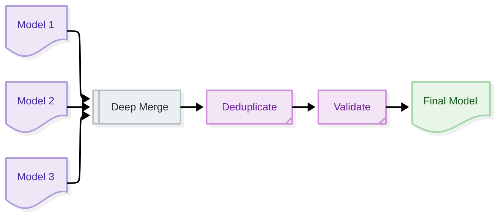
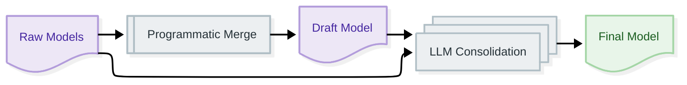

# Model Merging

**Navigation:** [← Extraction Backends](extraction-backends.md) | [Next: Batch Processing →](batch-processing.md)

---

## Overview

**Model merging** is the process of consolidating multiple Pydantic model instances into a single unified model. This is essential when extracting from multiple chunks or pages.

**In this guide:**
- Why merging is needed
- Programmatic vs LLM merging
- Deduplication strategies
- Conflict resolution
- Best practices

---

## Why Merging Matters

### The Multi-Extraction Problem

When processing large documents:

```python
# Document split into 3 chunks
chunk_1 = "Invoice INV-001, Issued by: Acme Corp"
chunk_2 = "Line items: Product A ($50), Product B ($100)"
chunk_3 = "Total: $150, Due date: 2024-01-31"

# Each chunk produces a partial model
model_1 = Invoice(invoice_number="INV-001", issued_by=Organization(name="Acme Corp"))
model_2 = Invoice(line_items=[LineItem(...), LineItem(...)])
model_3 = Invoice(total=150, due_date="2024-01-31")

# Need to merge into one complete model
final_model = merge(model_1, model_2, model_3)
```

**Without merging:** Incomplete, fragmented data  
**With merging:** Complete, unified model

---

## Merging Strategies

### Quick Comparison

| Strategy | Speed | Accuracy | Cost | Use Case |
|:---------|:------|:---------|:-----|:---------|
| **Programmatic** | Fast | Good | Free | Default |
| **LLM Consolidation** | Slow | Better | API cost | High accuracy needs |

---

## Programmatic Merging

### What is Programmatic Merging?

**Programmatic merging** uses rule-based algorithms to combine models without LLM calls. It's fast, free, and works well for most cases.

### How It Works



### Basic Usage

```python
from docling_graph.core.utils import merge_pydantic_models

# Multiple partial models
models = [
    Invoice(invoice_number="INV-001", issued_by=Organization(name="Acme")),
    Invoice(line_items=[LineItem(description="Product A", total=50)]),
    Invoice(total=150, due_date="2024-01-31")
]

# Merge programmatically
merged = merge_pydantic_models(models, Invoice)

print(merged)
# Invoice(
#     invoice_number="INV-001",
#     issued_by=Organization(name="Acme"),
#     line_items=[LineItem(description="Product A", total=50)],
#     total=150,
#     due_date="2024-01-31"
# )
```

---

### Merge Rules

#### 1. Field Overwriting

**Rule:** Non-empty values overwrite empty ones

```python
# Model 1
Invoice(invoice_number="INV-001", total=None)

# Model 2
Invoice(invoice_number=None, total=150)

# Merged
Invoice(invoice_number="INV-001", total=150)
```

#### 2. List Concatenation

**Rule:** Lists are concatenated and deduplicated

```python
# Model 1
Invoice(line_items=[LineItem(description="Product A")])

# Model 2
Invoice(line_items=[LineItem(description="Product B")])

# Merged
Invoice(line_items=[
    LineItem(description="Product A"),
    LineItem(description="Product B")
])
```

#### 3. Nested Object Merging

**Rule:** Nested objects are recursively merged

```python
# Model 1
Invoice(issued_by=Organization(name="Acme"))

# Model 2
Invoice(issued_by=Organization(address=Address(city="Paris")))

# Merged
Invoice(issued_by=Organization(
    name="Acme",
    address=Address(city="Paris")
))
```

#### 4. Entity Deduplication

**Rule:** Duplicate entities are detected and removed

```python
# Model 1
Invoice(line_items=[LineItem(description="Product A", total=50)])

# Model 2 (duplicate)
Invoice(line_items=[LineItem(description="Product A", total=50)])

# Merged (deduplicated)
Invoice(line_items=[LineItem(description="Product A", total=50)])
```

---

### Deduplication Algorithm

#### Content-Based Hashing

Entities are deduplicated using content hashing:

```python
def entity_hash(entity: dict) -> str:
    """Compute content hash for entity."""
    # Use stable fields (exclude id, __class__)
    stable_fields = {
        k: v for k, v in entity.items() 
        if k not in {"id", "__class__"} and v is not None
    }
    
    # Create stable JSON representation
    content = json.dumps(stable_fields, sort_keys=True)
    
    # Hash content
    return hashlib.blake2b(content.encode()).hexdigest()[:16]
```

**Example:**
```python
# These are considered duplicates
entity_1 = {"name": "Acme Corp", "city": "Paris"}
entity_2 = {"name": "Acme Corp", "city": "Paris"}

# These are different
entity_3 = {"name": "Acme Corp", "city": "London"}
```

---

## LLM Consolidation

### What is LLM Consolidation?

**LLM consolidation** uses an LLM to intelligently merge models, resolving conflicts and improving accuracy.

### When to Use

✅ **Use LLM consolidation when:**
- High accuracy is critical
- Complex conflict resolution needed
- Semantic understanding required
- Budget allows API calls

❌ **Don't use when:**
- Speed is priority
- Cost is concern
- Simple merging sufficient
- Processing many documents

---

### How It Works



### Configuration

```python
from docling_graph import PipelineConfig

config = PipelineConfig(
    source="document.pdf",
    template="my_templates.Invoice",
    backend="llm",
    inference="remote",
    llm_consolidation=True  # Enable LLM consolidation
)

config.run()
```

---

### LLM Consolidation Process

#### Step 1: Programmatic Merge

```python
# First, merge programmatically
programmatic_model = merge_pydantic_models(raw_models, template)
```

#### Step 2: LLM Review

```python
# Then, LLM reviews and improves
final_model = backend.consolidate_from_pydantic_models(
    raw_models=raw_models,
    programmatic_model=programmatic_model,
    template=template
)
```

#### Step 3: Validation

```python
# LLM output is validated against schema
validated_model = template.model_validate(llm_output)
```

---

### LLM Consolidation Prompt

The LLM receives:

1. **Schema:** Pydantic model structure
2. **Raw models:** All partial extractions
3. **Draft model:** Programmatic merge result

**Task:** Create the best possible consolidated model

---

## Complete Examples

### Example 1: Basic Programmatic Merge

```python
from docling_graph.core.utils import merge_pydantic_models
from my_templates import Invoice, Organization, LineItem

# Partial models from chunks
models = [
    Invoice(
        invoice_number="INV-001",
        issued_by=Organization(name="Acme Corp")
    ),
    Invoice(
        line_items=[
            LineItem(description="Product A", quantity=2, unit_price=50, total=100),
            LineItem(description="Product B", quantity=1, unit_price=150, total=150)
        ]
    ),
    Invoice(
        subtotal=250,
        tax=25,
        total=275,
        due_date="2024-01-31"
    )
]

# Merge
merged = merge_pydantic_models(models, Invoice)

print(f"Invoice: {merged.invoice_number}")
print(f"Issued by: {merged.issued_by.name}")
print(f"Line items: {len(merged.line_items)}")
print(f"Total: ${merged.total}")
```

### Example 2: With LLM Consolidation

```python
from docling_graph import PipelineConfig

config = PipelineConfig(
    source="contract.pdf",
    template="my_templates.Contract",
    
    # Enable LLM consolidation
    backend="llm",
    inference="remote",
    provider_override="mistral",
    llm_consolidation=True,  # Extra accuracy
    
    # Chunking settings
    use_chunking=True,
    processing_mode="many-to-one",
    
    output_dir="outputs/consolidated"
)

config.run()
```

### Example 3: Manual Consolidation

```python
from docling_graph.core.extractors.backends import LlmBackend
from docling_graph.core.utils import merge_pydantic_models
from docling_graph.llm_clients import MistralClient

# Extract from chunks
models = []
for chunk in chunks:
    model = backend.extract_from_markdown(chunk, template, is_partial=True)
    if model:
        models.append(model)

# Programmatic merge
programmatic = merge_pydantic_models(models, template)

# LLM consolidation
client = MistralClient(model="mistral-large-latest")
backend = LlmBackend(llm_client=client)

final = backend.consolidate_from_pydantic_models(
    raw_models=models,
    programmatic_model=programmatic,
    template=template
)

print(f"Consolidated {len(models)} models into 1")
```

### Example 4: Handling Merge Failures

```python
from docling_graph.core.utils import merge_pydantic_models

try:
    merged = merge_pydantic_models(models, template)
    print("✓ Merge successful")
    
except Exception as e:
    print(f"✗ Merge failed: {e}")
    
    # Fallback: use first model
    merged = models[0] if models else template()
    print("Using first model as fallback")
```

---

## Conflict Resolution

### Common Conflicts

#### 1. Duplicate Entities

**Problem:** Same entity appears multiple times

```python
# Chunk 1
Organization(name="Acme Corp", city="Paris")

# Chunk 2
Organization(name="Acme Corp", city="Paris")

# Solution: Deduplicated automatically
Organization(name="Acme Corp", city="Paris")  # Only one
```

#### 2. Conflicting Values

**Problem:** Different values for same field

```python
# Chunk 1
Invoice(total=150)

# Chunk 2
Invoice(total=275)

# Programmatic: Last value wins
Invoice(total=275)

# LLM: Intelligent resolution
Invoice(total=275)  # LLM chooses correct value
```

#### 3. Partial Information

**Problem:** Information spread across chunks

```python
# Chunk 1
Organization(name="Acme Corp")

# Chunk 2
Organization(address=Address(city="Paris"))

# Solution: Merged recursively
Organization(
    name="Acme Corp",
    address=Address(city="Paris")
)
```

---

## Performance Comparison

### Speed Benchmark

| Strategy | Models | Time | Throughput |
|:---------|:-------|:-----|:-----------|
| **Programmatic** | 5 | 0.01s | 500 merges/s |
| **LLM Consolidation** | 5 | 3s | 0.3 merges/s |
| **Programmatic** | 20 | 0.05s | 400 merges/s |
| **LLM Consolidation** | 20 | 8s | 0.1 merges/s |

### Accuracy Comparison

| Document Type | Programmatic | LLM Consolidation | Improvement |
|:--------------|:-------------|:------------------|:------------|
| **Simple invoice** | 95% | 96% | +1% |
| **Complex contract** | 88% | 94% | +6% |
| **Multi-page form** | 90% | 95% | +5% |
| **Research paper** | 85% | 92% | +7% |

---

## Best Practices

### 1. Use Programmatic by Default

```python
# ✅ Good - Fast and free
config = PipelineConfig(
    source="document.pdf",
    template="my_templates.Invoice",
    llm_consolidation=False  # Default
)
```

### 2. Enable LLM for Critical Data

```python
# ✅ Good - Extra accuracy when needed
config = PipelineConfig(
    source="legal_contract.pdf",
    template="my_templates.Contract",
    llm_consolidation=True  # High accuracy
)
```

### 3. Validate Merged Results

```python
# ✅ Good - Always validate
merged = merge_pydantic_models(models, template)

# Check completeness
if not merged.invoice_number:
    print("Warning: Missing invoice number")

if not merged.line_items:
    print("Warning: No line items")
```

### 4. Handle Empty Model Lists

```python
# ✅ Good - Handle edge cases
if not models:
    print("No models to merge")
    merged = template()  # Empty model
else:
    merged = merge_pydantic_models(models, template)
```

---

## Troubleshooting

### Issue: Duplicate Entities

**Solution:**
```python
# Deduplication is automatic
# If duplicates persist, check entity fields

# Ensure entities have stable identifiers
class Organization(BaseModel):
    name: str  # Used for deduplication
    address: Address | None = None
```

### Issue: Lost Information

**Solution:**
```python
# Check if fields are being overwritten
# Use LLM consolidation for better merging

config = PipelineConfig(
    source="document.pdf",
    template="my_templates.Invoice",
    llm_consolidation=True  # Better preservation
)
```

### Issue: Merge Validation Fails

**Solution:**
```python
# Check merged data structure
try:
    merged = merge_pydantic_models(models, template)
except ValidationError as e:
    print(f"Validation errors: {e.errors()}")
    
    # Inspect raw merged data
    dicts = [m.model_dump() for m in models]
    print(f"Raw data: {dicts}")
```

### Issue: Slow Consolidation

**Solution:**
```python
# Disable LLM consolidation for speed
config = PipelineConfig(
    source="document.pdf",
    template="my_templates.Invoice",
    llm_consolidation=False  # Faster
)
```

---

## Advanced Techniques

### Custom Merge Logic

For special cases, implement custom merging:

```python
from docling_graph.core.utils import merge_pydantic_models

def custom_merge(models, template):
    """Custom merge with special rules."""
    
    # Start with programmatic merge
    base = merge_pydantic_models(models, template)
    
    # Apply custom logic
    if base.total is None and base.line_items:
        # Calculate total from line items
        base.total = sum(item.total for item in base.line_items)
    
    return base

# Use custom merge
merged = custom_merge(models, Invoice)
```

---

## Next Steps

Now that you understand model merging:

1. **[Batch Processing →](batch-processing.md)** - Optimize chunk processing
2. **[Extraction Backends →](extraction-backends.md)** - Understand backends
3. **[Graph Management →](../06-graph-management/index.md)** - Work with knowledge graphs

---

## Quick Reference

### Programmatic Merge

```python
from docling_graph.core.utils import merge_pydantic_models

merged = merge_pydantic_models(models, template)
```

### With LLM Consolidation

```python
config = PipelineConfig(
    source="document.pdf",
    template="my_templates.Invoice",
    llm_consolidation=True
)
```

### Manual LLM Consolidation

```python
final = backend.consolidate_from_pydantic_models(
    raw_models=models,
    programmatic_model=programmatic,
    template=template
)
```

---

**Navigation:** [← Extraction Backends](extraction-backends.md) | [Next: Batch Processing →](batch-processing.md)