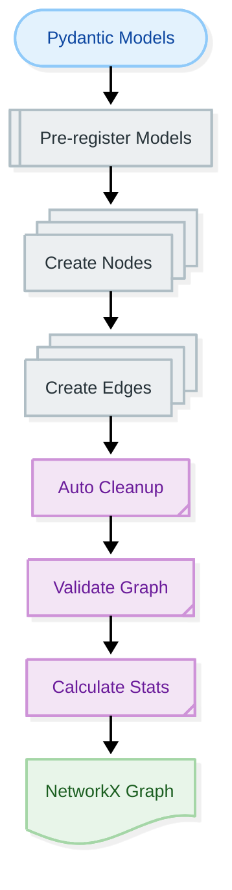

# Graph Conversion

**Navigation:** [← Graph Management](index.md) | [Next: Export Formats →](export-formats.md)

---

## Overview

**Graph conversion** transforms Pydantic models into NetworkX directed graphs, creating nodes for entities and edges for relationships. This is the foundation of knowledge graph creation.

**In this guide:**
- Conversion process
- Node and edge creation
- Node ID registry
- Graph validation
- Automatic cleanup

---

## Conversion Process

### High-Level Flow



---

## GraphConverter

### Basic Usage

```python
from docling_graph.core.converters import GraphConverter

# Create converter
converter = GraphConverter()

# Convert models to graph
graph, metadata = converter.pydantic_list_to_graph(models)

print(f"Created graph with {metadata.node_count} nodes and {metadata.edge_count} edges")
```

### With Configuration

```python
from docling_graph.core.converters import GraphConverter

converter = GraphConverter(
    add_reverse_edges=False,  # Don't create bidirectional edges
    validate_graph=True,      # Validate structure
    auto_cleanup=True         # Remove phantom nodes
)

graph, metadata = converter.pydantic_list_to_graph(models)
```

---

## Node Creation

### What Becomes a Node?

**Entities** (models with `is_entity=True`) become nodes:

```python
from pydantic import BaseModel

# ✅ Becomes a node
class Organization(BaseModel):
    name: str
    model_config = {"is_entity": True}  # Default

# ❌ Does NOT become a node
class Address(BaseModel):
    street: str
    city: str
    model_config = {"is_entity": False}  # Component
```

### Node Structure

```python
# Node in graph
{
    "id": "organization_acme_corp",
    "label": "Organization",
    "type": "entity",
    "__class__": "Organization",
    "name": "Acme Corp",
    "address": None  # Reference to nested entity
}
```

---

## Edge Creation

### Automatic Edge Generation

Edges are created automatically from model relationships:

```python
class Invoice(BaseModel):
    invoice_number: str
    issued_by: Organization  # Creates edge: Invoice -> Organization
    line_items: List[LineItem]  # Creates edges: Invoice -> LineItem (multiple)
```

### Edge Structure

```python
# Edge in graph
{
    "source": "invoice_001",
    "target": "organization_acme_corp",
    "label": "issued_by",
    "properties": {}
}
```

### Custom Edge Labels

```python
from pydantic import BaseModel, Field

class Invoice(BaseModel):
    issued_by: Organization = Field(
        json_schema_extra={"edge_label": "ISSUED_BY"}
    )
```

**Result:** Edge label becomes `ISSUED_BY` instead of `issued_by`

---

## Node ID Registry

### What is Node ID Registry?

The **NodeIDRegistry** ensures consistent, deterministic node IDs across multiple extractions.

### How It Works

```python
# Same entity always gets same ID
org1 = Organization(name="Acme Corp")
org2 = Organization(name="Acme Corp")

# Both get ID: "organization_acme_corp"
id1 = registry.get_node_id(org1)
id2 = registry.get_node_id(org2)

assert id1 == id2  # True
```

### ID Generation

```python
def generate_node_id(model: BaseModel) -> str:
    """Generate deterministic node ID."""
    class_name = model.__class__.__name__.lower()
    
    # Use stable fields for identity
    stable_fields = {
        k: v for k, v in model.model_dump().items()
        if k not in {"id", "__class__"} and v is not None
    }
    
    # Create content hash
    content = json.dumps(stable_fields, sort_keys=True)
    hash_suffix = hashlib.blake2b(content.encode()).hexdigest()[:8]
    
    return f"{class_name}_{hash_suffix}"
```

---

## Graph Validation

### Automatic Validation

Validation checks graph structure:

```python
converter = GraphConverter(validate_graph=True)
graph, metadata = converter.pydantic_list_to_graph(models)

# Validates:
# - No isolated nodes
# - Valid node IDs
# - Valid edge connections
# - No self-loops (optional)
```

### Manual Validation

```python
from docling_graph.core.utils import validate_graph_structure

try:
    validate_graph_structure(graph, raise_on_error=True)
    print("✓ Graph structure valid")
except ValueError as e:
    print(f"✗ Validation failed: {e}")
```

---

## Automatic Cleanup

### What Gets Cleaned?

Automatic cleanup removes:

1. **Phantom nodes** - Nodes with no data
2. **Duplicate nodes** - Same entity multiple times
3. **Orphaned edges** - Edges to non-existent nodes
4. **Empty attributes** - Null or empty values

### Configuration

```python
converter = GraphConverter(
    auto_cleanup=True  # Enable cleanup (default)
)

graph, metadata = converter.pydantic_list_to_graph(models)
```

### Manual Cleanup

```python
from docling_graph.core.utils import GraphCleaner

cleaner = GraphCleaner(verbose=True)
cleaned_graph = cleaner.clean_graph(graph)

print(f"Removed {graph.number_of_nodes() - cleaned_graph.number_of_nodes()} phantom nodes")
```

---

## Complete Examples

### Example 1: Basic Conversion

```python
from docling_graph.core.converters import GraphConverter
from my_templates import Invoice, Organization, LineItem

# Create sample models
models = [
    Invoice(
        invoice_number="INV-001",
        issued_by=Organization(name="Acme Corp"),
        line_items=[
            LineItem(description="Product A", total=100),
            LineItem(description="Product B", total=200)
        ],
        total=300
    )
]

# Convert to graph
converter = GraphConverter()
graph, metadata = converter.pydantic_list_to_graph(models)

print(f"Nodes: {metadata.node_count}")
print(f"Edges: {metadata.edge_count}")
print(f"Node types: {metadata.node_types}")
```

### Example 2: With Reverse Edges

```python
from docling_graph.core.converters import GraphConverter

# Create bidirectional edges
converter = GraphConverter(add_reverse_edges=True)
graph, metadata = converter.pydantic_list_to_graph(models)

# Original edge: Invoice -> Organization (ISSUED_BY)
# Reverse edge: Organization -> Invoice (reverse_ISSUED_BY)

print(f"Total edges (with reverse): {metadata.edge_count}")
```

### Example 3: Shared Registry for Batches

```python
from docling_graph.core.converters import GraphConverter, NodeIDRegistry

# Create shared registry
registry = NodeIDRegistry()

# Convert first batch
converter1 = GraphConverter(registry=registry)
graph1, _ = converter1.pydantic_list_to_graph(batch1_models)

# Convert second batch (same registry)
converter2 = GraphConverter(registry=registry)
graph2, _ = converter2.pydantic_list_to_graph(batch2_models)

# Same entities get same IDs across batches
print(f"Registry has {registry.get_stats()['total_entities']} unique entities")
```

### Example 4: Custom Configuration

```python
from docling_graph.core.converters import GraphConverter, GraphConfig

# Create custom config
config = GraphConfig(
    add_reverse_edges=True,
    validate_graph=True,
    node_id_prefix="doc_"
)

converter = GraphConverter(config=config)
graph, metadata = converter.pydantic_list_to_graph(models)
```

---

## Graph Metadata

### Metadata Structure

```python
@dataclass
class GraphMetadata:
    node_count: int
    edge_count: int
    node_types: Dict[str, int]
    edge_types: Dict[str, int]
    avg_degree: float
    density: float
    source_model_count: int
```

### Using Metadata

```python
graph, metadata = converter.pydantic_list_to_graph(models)

print(f"Graph Statistics:")
print(f"  Nodes: {metadata.node_count}")
print(f"  Edges: {metadata.edge_count}")
print(f"  Density: {metadata.density:.2f}")
print(f"  Avg degree: {metadata.avg_degree:.2f}")

print(f"\nNode Types:")
for node_type, count in metadata.node_types.items():
    print(f"  {node_type}: {count}")

print(f"\nEdge Types:")
for edge_type, count in metadata.edge_types.items():
    print(f"  {edge_type}: {count}")
```

---

## Advanced Features

### Reverse Edges

Create bidirectional relationships:

```python
converter = GraphConverter(add_reverse_edges=True)
graph, metadata = converter.pydantic_list_to_graph(models)

# For each edge A -> B, creates B -> A
# Useful for graph traversal in both directions
```

### Custom Node IDs

Provide custom node ID logic:

```python
from docling_graph.core.converters import NodeIDRegistry

class CustomRegistry(NodeIDRegistry):
    def generate_node_id(self, model: BaseModel) -> str:
        # Custom ID generation
        return f"custom_{model.__class__.__name__}_{hash(model)}"

registry = CustomRegistry()
converter = GraphConverter(registry=registry)
```

---

## Performance Optimization

### Batch Processing

```python
# Process large model lists efficiently
converter = GraphConverter(auto_cleanup=True)

# Convert in single call (efficient)
graph, metadata = converter.pydantic_list_to_graph(all_models)

# Don't convert one by one (inefficient)
# for model in models:
#     graph, _ = converter.pydantic_list_to_graph([model])
```

### Memory Management

```python
# For very large graphs
converter = GraphConverter(
    auto_cleanup=True,  # Remove unnecessary nodes
    validate_graph=False  # Skip validation for speed
)

graph, metadata = converter.pydantic_list_to_graph(models)

# Clear registry after conversion
converter.registry.clear()
```

---

## Troubleshooting

### Issue: Empty Graph

**Solution:**
```python
# Check if models have entities
for model in models:
    if hasattr(model, 'model_config'):
        is_entity = model.model_config.get('is_entity', True)
        print(f"{model.__class__.__name__}: is_entity={is_entity}")
```

### Issue: Missing Edges

**Solution:**
```python
# Ensure relationships are defined
class Invoice(BaseModel):
    issued_by: Organization  # Must be typed as entity
    # Not: issued_by: dict  # Won't create edge
```

### Issue: Duplicate Nodes

**Solution:**
```python
# Enable auto cleanup
converter = GraphConverter(auto_cleanup=True)
graph, metadata = converter.pydantic_list_to_graph(models)
```

### Issue: Validation Fails

**Solution:**
```python
# Check graph structure
print(f"Nodes: {graph.number_of_nodes()}")
print(f"Edges: {graph.number_of_edges()}")

# Inspect nodes
for node_id, data in list(graph.nodes(data=True))[:5]:
    print(f"Node: {node_id}, Data: {data}")
```

---

## Best Practices

### 1. Use Shared Registry for Batches

```python
# ✅ Good - Consistent IDs across batches
registry = NodeIDRegistry()

for batch in batches:
    converter = GraphConverter(registry=registry)
    graph, _ = converter.pydantic_list_to_graph(batch)
```

### 2. Enable Auto Cleanup

```python
# ✅ Good - Clean graphs
converter = GraphConverter(auto_cleanup=True)
```

### 3. Validate in Development

```python
# ✅ Good - Catch issues early
converter = GraphConverter(validate_graph=True)
```

### 4. Disable Validation in Production

```python
# ✅ Good - Faster in production
converter = GraphConverter(validate_graph=False)
```

---

## Next Steps

Now that you understand graph conversion:

1. **[Export Formats →](export-formats.md)** - Export graphs to CSV, Cypher, JSON
2. **[Visualization →](visualization.md)** - Visualize your graphs
3. **[Neo4j Integration →](neo4j-integration.md)** - Import into Neo4j

---

## Quick Reference

### Basic Conversion

```python
from docling_graph.core.converters import GraphConverter

converter = GraphConverter()
graph, metadata = converter.pydantic_list_to_graph(models)
```

### With Options

```python
converter = GraphConverter(
    add_reverse_edges=True,
    validate_graph=True,
    auto_cleanup=True
)
```

### Shared Registry

```python
from docling_graph.core.converters import NodeIDRegistry

registry = NodeIDRegistry()
converter = GraphConverter(registry=registry)
```

---

**Navigation:** [← Graph Management](index.md) | [Next: Export Formats →](export-formats.md)