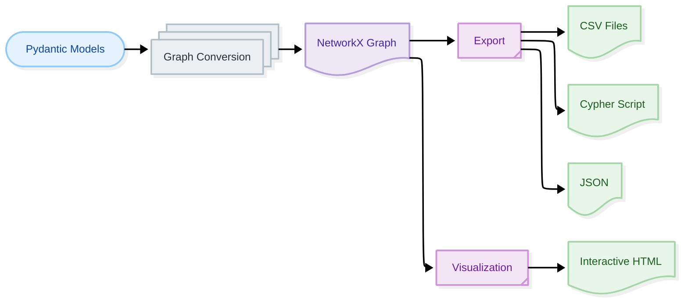

# Knowledge Graph Management

**Navigation:** [← Extraction Process](../05-extraction-process/index.md) | [Next: Graph Conversion →](graph-conversion.md)

---

## Overview

**Knowledge Graph Management** covers converting extracted Pydantic models into graph structures, exporting to various formats, and visualizing the results.

**What you'll learn:**
- Graph conversion from Pydantic models
- Export formats (CSV, Cypher, JSON)
- Visualization techniques
- Graph analysis and statistics
- Neo4j integration

---

## The Graph Pipeline



---

## Key Concepts

### 1. Graph Conversion

Transform Pydantic models into graph structure:

```python
from docling_graph.core.converters import GraphConverter

converter = GraphConverter()
graph, metadata = converter.pydantic_list_to_graph(models)

print(f"Nodes: {metadata.node_count}")
print(f"Edges: {metadata.edge_count}")
```

**Learn more:** [Graph Conversion →](graph-conversion.md)

---

### 2. Export Formats

Export graphs in multiple formats:

```python
from docling_graph.core.exporters import CSVExporter, CypherExporter

# CSV export
CSVExporter().export(graph, output_dir)

# Cypher export
CypherExporter().export(graph, output_file)
```

**Learn more:** [Export Formats →](export-formats.md)

---

### 3. Visualization

Generate interactive visualizations:

```python
from docling_graph.core.visualizers import InteractiveVisualizer

visualizer = InteractiveVisualizer()
visualizer.save_cytoscape_graph(graph, "graph.html")
```

**Learn more:** [Visualization →](visualization.md)

---

### 4. Neo4j Integration

Import graphs into Neo4j:

```bash
# Import Cypher script
cat graph.cypher | cypher-shell -u neo4j -p password
```

**Learn more:** [Neo4j Integration →](neo4j-integration.md)

---

## Quick Start

### Complete Pipeline

```python
from docling_graph import PipelineConfig

# Run complete pipeline
config = PipelineConfig(
    source="document.pdf",
    template="my_templates.Invoice",
    backend="llm",
    inference="local",
    export_format="csv",  # or "cypher"
    output_dir="outputs"
)

config.run()

# Outputs:
# - outputs/nodes.csv
# - outputs/edges.csv
# - outputs/graph_stats.json
# - outputs/visualization.html
```

---

## Graph Structure

### Nodes

**Nodes** represent entities from your Pydantic models:

```python
# Node structure
{
    "id": "invoice_001",
    "label": "Invoice",
    "type": "entity",
    "invoice_number": "INV-001",
    "total": 1000
}
```

### Edges

**Edges** represent relationships between entities:

```python
# Edge structure
{
    "source": "invoice_001",
    "target": "org_acme",
    "label": "ISSUED_BY"
}
```

---

## Export Formats Comparison

| Format | Best For | File Type | Use Case |
|:-------|:---------|:----------|:---------|
| **CSV** | Analysis, spreadsheets | `.csv` | Data analysis, Excel |
| **Cypher** | Neo4j import | `.cypher` | Graph database |
| **JSON** | APIs, processing | `.json` | Programmatic access |

---

## Section Contents

### 1. [Graph Conversion](graph-conversion.md)
Learn how Pydantic models are converted to NetworkX graphs.

**Topics:**
- Node creation
- Edge generation
- Node ID registry
- Graph validation
- Automatic cleanup

---

### 2. [Export Formats](export-formats.md)
Understand different export formats and when to use them.

**Topics:**
- CSV export (nodes and edges)
- Cypher export (Neo4j)
- JSON export (programmatic)
- Format selection

---

### 3. [Visualization](visualization.md)
Generate interactive visualizations of your knowledge graphs.

**Topics:**
- Interactive HTML graphs
- Markdown reports
- Graph statistics
- Customization options

---

### 4. [Neo4j Integration](neo4j-integration.md)
Import and query graphs in Neo4j database.

**Topics:**
- Cypher import
- Neo4j setup
- Query examples
- Best practices

---

### 5. [Graph Analysis](graph-analysis.md)
Analyze graph structure and statistics.

**Topics:**
- Node and edge counts
- Graph metrics
- Connectivity analysis
- Quality checks

---

### 6. Advanced Topics
Advanced graph management techniques covered in other sections.

**See also:**
- [Custom Exporters](../10-advanced/custom-exporters.md)
- [Performance Tuning](../10-advanced/performance-tuning.md)
- [Graph Analysis](graph-analysis.md)

---

## Common Workflows

### Workflow 1: CSV Analysis

```python
from docling_graph import PipelineConfig

# Extract and export to CSV
config = PipelineConfig(
    source="invoices.pdf",
    template="my_templates.Invoice",
    export_format="csv",
    output_dir="analysis"
)

config.run()

# Analyze in Python
import pandas as pd

nodes = pd.read_csv("analysis/nodes.csv")
edges = pd.read_csv("analysis/edges.csv")

print(f"Total invoices: {len(nodes[nodes['label'] == 'Invoice'])}")
```

---

### Workflow 2: Neo4j Import

```python
from docling_graph import PipelineConfig

# Extract and export to Cypher
config = PipelineConfig(
    source="contracts.pdf",
    template="my_templates.Contract",
    export_format="cypher",
    output_dir="neo4j_import"
)

config.run()

# Import to Neo4j
# cat neo4j_import/graph.cypher | cypher-shell
```

---

### Workflow 3: Programmatic Access

```python
from docling_graph import PipelineConfig
import json

# Extract and access programmatically
config = PipelineConfig(
    source="document.pdf",
    template="my_templates.Invoice",
    output_dir="data"
)

config.run()

# Load graph data
with open("data/graph_data.json") as f:
    graph_data = json.load(f)

# Process nodes
for node in graph_data["nodes"]:
    print(f"{node['type']}: {node['id']}")
```

---

## Graph Statistics

### Automatic Statistics

Every pipeline run generates statistics:

```json
{
  "node_count": 15,
  "edge_count": 18,
  "node_types": {
    "Invoice": 1,
    "Organization": 2,
    "Address": 3,
    "LineItem": 9
  },
  "edge_types": {
    "ISSUED_BY": 1,
    "SENT_TO": 1,
    "LOCATED_AT": 5,
    "CONTAINS_ITEM": 9
  },
  "avg_degree": 2.4,
  "density": 0.17
}
```

### Using Statistics

```python
import json

# Load statistics
with open("outputs/graph_stats.json") as f:
    stats = json.load(f)

print(f"Graph has {stats['node_count']} nodes")
print(f"Most common node type: {max(stats['node_types'], key=stats['node_types'].get)}")
```

---

## Visualization Preview

### Interactive HTML

Every pipeline run generates an interactive visualization:

```
outputs/
└── visualization.html  # Open in browser
```

**Features:**
- Zoom and pan
- Node inspection
- Search functionality
- Export to image

---

## Best Practices

### 1. Choose the Right Format

```python
# ✅ Good - Match format to use case
if use_case == "neo4j":
    export_format = "cypher"
elif use_case == "analysis":
    export_format = "csv"
else:
    export_format = "csv"  # Default
```

### 2. Validate Graph Structure

```python
# ✅ Good - Enable validation
converter = GraphConverter(validate_graph=True)
graph, metadata = converter.pydantic_list_to_graph(models)
```

### 3. Use Automatic Cleanup

```python
# ✅ Good - Enable cleanup
converter = GraphConverter(auto_cleanup=True)
graph, metadata = converter.pydantic_list_to_graph(models)
```

### 4. Check Statistics

```python
# ✅ Good - Verify graph quality
if metadata.node_count == 0:
    print("Warning: Empty graph")

if metadata.edge_count == 0:
    print("Warning: No relationships")
```

---

## Troubleshooting

### Issue: Empty Graph

**Solution:**
```python
# Check if models were extracted
if not models:
    print("No models extracted")

# Check if models have relationships
for model in models:
    print(f"Model: {model}")
```

### Issue: Missing Relationships

**Solution:**
```python
# Ensure entities are properly defined
class Organization(BaseModel):
    name: str
    # Must be entity to create nodes
    model_config = {"is_entity": True}
```

### Issue: Export Fails

**Solution:**
```python
# Check output directory exists
import os
os.makedirs("outputs", exist_ok=True)

# Check graph is not empty
if graph.number_of_nodes() == 0:
    print("Cannot export empty graph")
```

---

## Next Steps

Ready to dive deeper? Start with:

1. **[Graph Conversion →](graph-conversion.md)** - Learn graph conversion
2. **[Export Formats →](export-formats.md)** - Choose export format
3. **[Visualization →](visualization.md)** - Visualize your graphs

---

## Quick Reference

### Run Complete Pipeline

```python
from docling_graph import PipelineConfig

config = PipelineConfig(
    source="document.pdf",
    template="my_templates.Invoice",
    export_format="csv",
    output_dir="outputs"
)

config.run()
```

### Manual Graph Conversion

```python
from docling_graph.core.converters import GraphConverter

converter = GraphConverter()
graph, metadata = converter.pydantic_list_to_graph(models)
```

### Export Graph

```python
from docling_graph.core.exporters import CSVExporter, CypherExporter

# CSV
CSVExporter().export(graph, output_dir)

# Cypher
CypherExporter().export(graph, output_file)
```

---

**Navigation:** [← Extraction Process](../05-extraction-process/index.md) | [Next: Graph Conversion →](graph-conversion.md)