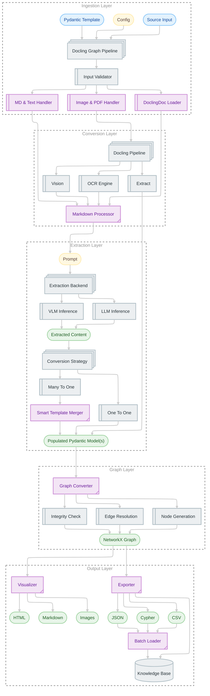

```mermaid
%%{init: {'theme': 'redux-dark', 'look': 'default', 'layout': 'elk'}}%%
flowchart TB
    %% 1. Define Classes
    classDef input fill:#E3F2FD,stroke:#90CAF9,color:#0D47A1
    classDef config fill:#FFF8E1,stroke:#FFECB3,color:#5D4037
    classDef output fill:#E8F5E9,stroke:#A5D6A7,color:#1B5E20
    classDef decision fill:#FFE0B2,stroke:#FFB74D,color:#E65100
    classDef data fill:#EDE7F6,stroke:#B39DDB,color:#4527A0
    classDef operator fill:#F3E5F5,stroke:#CE93D8,color:#6A1B9A
    classDef process fill:#ECEFF1,stroke:#B0BEC5,color:#263238
    
    %% Transparent Subgraph Style
    classDef subgraph_style fill:none,stroke:#969696,stroke-width:2px,stroke-dasharray: 5 5,color:#969696

    %% 2. Define Nodes & Subgraphs
    subgraph S1 ["Ingestion Layer"]
        A@{ shape: terminal, label: "Source Input" }
        n2@{ shape: terminal, label: "Config" }
        n3@{ shape: terminal, label: "Pydantic Template" }
        n4@{ shape: procs, label: "Docling Graph Pipeline" }
        n35@{ shape: lin-proc, label: "Input Validator" }
        
        %% HANDLERS
        n37@{ shape: lin-proc, label: "Image & PDF Handler" }
        n39@{ shape: lin-proc, label: "DoclingDoc Loader" }
        n40@{ shape: lin-proc, label: "MD & Text Handler" }
    end

    subgraph S2 ["Conversion Layer"]
        n6@{ shape: procs, label: "Docling Pipeline" }
        %% Defined first to prioritize placement
        n25@{ shape: lin-proc, label: "Extract" } 
        n7@{ shape: lin-proc, label: "OCR Engine" }
        n8@{ shape: lin-proc, label: "Vision" }
        n9@{ shape: tag-proc, label: "Markdown Processor" }
    end

    subgraph S3 ["Extraction Layer"]
        n16@{ shape: terminal, label: "Prompt" }
        n13@{ shape: procs, label: "Extraction Backend" }
        n14@{ shape: lin-proc, label: "LLM Inference" }
        n15@{ shape: lin-proc, label: "VLM Inference" }
        n17@{ shape: terminal, label: "Extracted Content" }
        n10@{ shape: procs, label: "Conversion Strategy" }
        n11@{ shape: lin-proc, label: "One To One" }
        n12@{ shape: lin-proc, label: "Many To One" }
        n18@{ shape: tag-proc, label: "Smart Template Merger" }
        n20@{ shape: terminal, label: "Populated Pydantic Model(s)" }
    end

    subgraph S4 ["Graph Layer"]
        %% ENTRY POINT
        n21@{ shape: tag-proc, label: "Graph Converter" }
        
        %% INTERNAL STEPS
        n21a@{ shape: lin-proc, label: "Node Generation" }
        n21b@{ shape: lin-proc, label: "Edge Resolution" }
        n21c@{ shape: lin-proc, label: "Integrity Check" }
        
        n22@{ shape: terminal, label: "NetworkX Graph" }
    end

    subgraph S5 ["Output Layer"]
        n23@{ shape: tag-proc, label: "Exporter" }
        n29@{ shape: terminal, label: "CSV" }
        n30@{ shape: terminal, label: "Cypher" }
        n31@{ shape: terminal, label: "JSON" }
        n34@{ shape: tag-proc, label: "Batch Loader" }
        n33@{ shape: db, label: "Knowledge Base" }
        n24@{ shape: tag-proc, label: "Visualizer" }
        n28@{ shape: terminal, label: "Images" }
        n27@{ shape: terminal, label: "HTML" }
        n26@{ shape: terminal, label: "Markdown" }
    end

    %% 3. Define Connections
    A & n2 & n3 --> n4
    n4 --> n35
    
    %% Validator Routing
    n35 --> n37 & n39 & n40
    
    %% HANDLER CONNECTIONS
    n37 --> n6
    n39 --> n9
    n40 --> n9
    
    %% Processing
    n6 --> n25 & n7 & n8
    n7 & n8 --> n9
    
    %% Extraction
    n9 --> n16
    n16 --> n13
    n13 --> n14 & n15
    n14 & n15 --> n17
    n17 --> n10
    
    %% Strategy
    n10 --> n11 & n12
    n12 --> n18
    n11 & n18 & n25 --> n20
    
    %% Graph (Updated Flow)
    n20 --> n21
    n21 --> n21a
    n21 --> n21b
    n21 --> n21c
    n21a --> n22
    n21b --> n22
    n21c --> n22
    n22 --> n23 & n24
    
    %% Export
    n23 --> n29 & n30 & n31 & n33
    n29 & n30 & n31 --> n34
    n34 --> n33
    
    %% Visuals
    n24 --> n28 & n27 & n26

    %% 4. Apply Classes
    class A,n3 input
    class n2,n16 config
    class n4,n35,n6,n7,n8,n25,n13,n14,n15,n10,n11,n12,n33 process
    class n21a,n21b,n21c process
    class n37,n39,n40,n9,n18,n21,n23,n34,n24 operator
    class n17,n20,n22,n29,n30,n31,n28,n27,n26 output
    class S1,S2,S3,S4,S5 subgraph_style
```