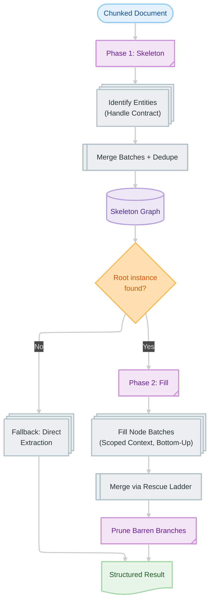

```mermaid
%%{init: {'theme': 'redux-dark', 'look': 'default', 'layout': 'elk'}}%%
flowchart TD
    %% 1. Define Classes
    classDef input fill:#E3F2FD,stroke:#90CAF9,color:#0D47A1
    classDef config fill:#FFF8E1,stroke:#FFECB3,color:#5D4037
    classDef output fill:#E8F5E9,stroke:#A5D6A7,color:#1B5E20
    classDef decision fill:#FFE0B2,stroke:#FFB74D,color:#E65100
    classDef data fill:#EDE7F6,stroke:#B39DDB,color:#4527A0
    classDef operator fill:#F3E5F5,stroke:#CE93D8,color:#6A1B9A
    classDef process fill:#ECEFF1,stroke:#B0BEC5,color:#263238

    %% 2. Define Nodes
    A@{ shape: terminal, label: "Chunked Document" }

    B@{ shape: tag-proc, label: "Phase 1: Skeleton" }
    C@{ shape: procs, label: "Identify Entities\n(Handle Contract)" }
    D@{ shape: lin-proc, label: "Merge Batches + Dedupe" }
    E@{ shape: db, label: "Skeleton Graph" }

    F{"Root instance<br/>found?"}

    G@{ shape: procs, label: "Fallback: Direct<br/>Extraction" }

    H@{ shape: tag-proc, label: "Phase 2: Fill" }
    I@{ shape: procs, label: "Fill Node Batches\n(Scoped Context, Bottom-Up)" }
    J@{ shape: lin-proc, label: "Merge via Rescue Ladder" }
    K@{ shape: tag-proc, label: "Prune Barren Branches" }

    L@{ shape: doc, label: "Structured Result" }

    %% 3. Define Connections
    A --> B
    B --> C
    C --> D
    D --> E
    E --> F

    F -- No --> G
    G --> L

    F -- Yes --> H
    H --> I
    I --> J
    J --> K
    K --> L

    %% 4. Apply Classes
    class A input
    class B,H,K operator
    class C,D,G,I,J process
    class E data
    class F decision
    class L output
```
