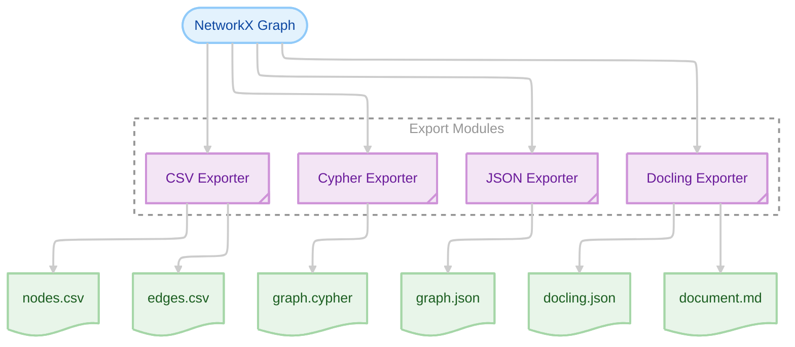

```mermaid
%%{init: {'theme': 'redux-dark', 'look': 'default', 'layout': 'elk'}}%%
flowchart TB
    %% 1. Define Classes
    classDef input fill:#E3F2FD,stroke:#90CAF9,color:#0D47A1
    classDef config fill:#FFF8E1,stroke:#FFECB3,color:#5D4037
    classDef output fill:#E8F5E9,stroke:#A5D6A7,color:#1B5E20
    classDef decision fill:#FFE0B2,stroke:#FFB74D,color:#E65100
    classDef data fill:#EDE7F6,stroke:#B39DDB,color:#4527A0
    classDef operator fill:#F3E5F5,stroke:#CE93D8,color:#6A1B9A
    classDef process fill:#ECEFF1,stroke:#B0BEC5,color:#263238
    classDef subgraph_style fill:none,stroke:#969696,stroke-width:2px,stroke-dasharray: 5,color:#969696

    %% 2. Define Nodes & Subgraphs
    A@{ shape: terminal, label: "NetworkX Graph" }

    subgraph subGraph0["Export Modules"]
        B@{ shape: tag-proc, label: "CSV Exporter" }
        C@{ shape: tag-proc, label: "Cypher Exporter" }
        D@{ shape: tag-proc, label: "JSON Exporter" }
        E@{ shape: tag-proc, label: "Docling Exporter" }
    end

    %% Output Files
    F@{ shape: doc, label: "nodes.csv" }
    n1@{ shape: doc, label: "edges.csv" }
    G@{ shape: doc, label: "graph.cypher" }
    H@{ shape: doc, label: "graph.json" }
    I@{ shape: doc, label: "docling.json" }
    n2@{ shape: doc, label: "document.md" }

    %% 3. Define Connections
    A --> B & C & D & E
    
    B --> F & n1
    C --> G
    D --> H
    E --> I & n2

    %% 4. Apply Classes
    class A input
    class B,C,D,E operator
    class F,n1,G,H,I,n2 output
    class subGraph0 subgraph_style
```