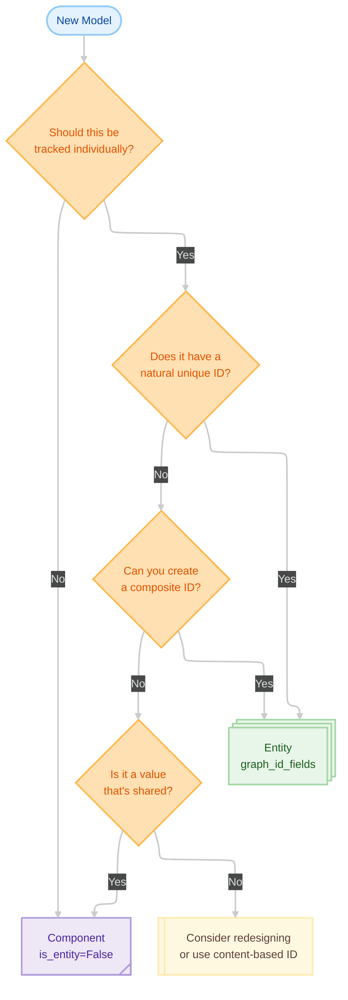

```mermaid
%%{init: {'theme': 'redux-dark', 'look': 'default', 'layout': 'elk'}}%%
flowchart TD
    %% 1. Define Classes
    classDef input fill:#E3F2FD,stroke:#90CAF9,color:#0D47A1
    classDef config fill:#FFF8E1,stroke:#FFECB3,color:#5D4037
    classDef output fill:#E8F5E9,stroke:#A5D6A7,color:#1B5E20
    classDef decision fill:#FFE0B2,stroke:#FFB74D,color:#E65100
    classDef data fill:#EDE7F6,stroke:#B39DDB,color:#4527A0
    classDef operator fill:#F3E5F5,stroke:#CE93D8,color:#6A1B9A
    classDef process fill:#ECEFF1,stroke:#B0BEC5,color:#263238

    %% 2. Define Nodes
    A@{ shape: terminal, label: "New Model" }
    
    B{"Should this be<br/>tracked individually?"}
    C{"Does it have a<br/>natural unique ID?"}
    F{"Can you create<br/>a composite ID?"}
    G{"Is it a value<br/>that's shared?"}
    
    %% Outcomes
    D@{ shape: tag-proc, label: "Component<br/>is_entity=False" }
    E@{ shape: procs, label: "Entity<br/>graph_id_fields" }
    H@{ shape: lin-proc, label: "Consider redesigning<br/>or use content-based ID" }

    %% 3. Define Connections
    A --> B
    B -- Yes --> C
    B -- No --> D
    
    C -- Yes --> E
    C -- No --> F
    
    F -- Yes --> E
    F -- No --> G
    
    G -- Yes --> D
    G -- No --> H

    %% 4. Apply Classes
    class A input
    class B,C,F,G decision
    class E output
    class D data
    class H config
```