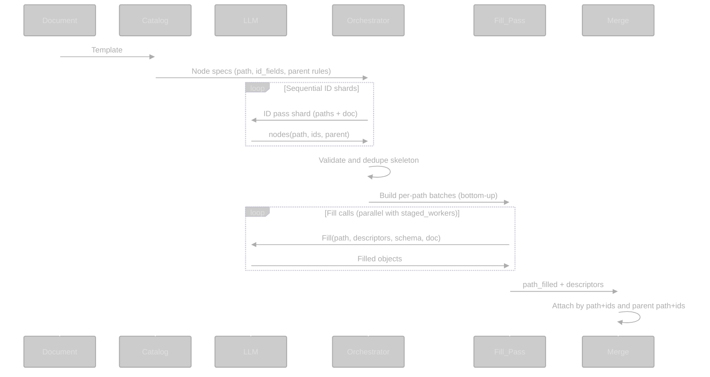

```mermaid
%%{init: {'theme': 'redux-dark', 'look': 'default', 'layout': 'elk',
  'themeVariables': {'loopTextColor': '#ADADAD', 'signalColor': '#ADADAD', 'signalTextColor': '#ADADAD', 'actorBkg': '#CCCCCC', 'actorBorder': '#ADADAD'}
}}%%
sequenceDiagram
  participant Doc as Document
  participant Catalog as Catalog
  participant LLM as LLM
  participant Orch as Orchestrator
  participant Fill as Fill_Pass
  participant Merge as Merge

  Doc->>Catalog: Template
  Catalog->>Orch: Node specs (path, id_fields, parent rules)
  loop Sequential ID shards
    Orch->>LLM: ID pass shard (paths + doc)
    LLM->>Orch: nodes(path, ids, parent)
  end
  Orch->>Orch: Validate and dedupe skeleton
  Orch->>Fill: Build per-path batches (bottom-up)
  loop Fill calls (parallel with staged_workers)
    Fill->>LLM: Fill(path, descriptors, schema, doc)
    LLM->>Fill: Filled objects
  end
  Fill->>Merge: path_filled + descriptors
  Merge->>Merge: Attach by path+ids and parent path+ids
```