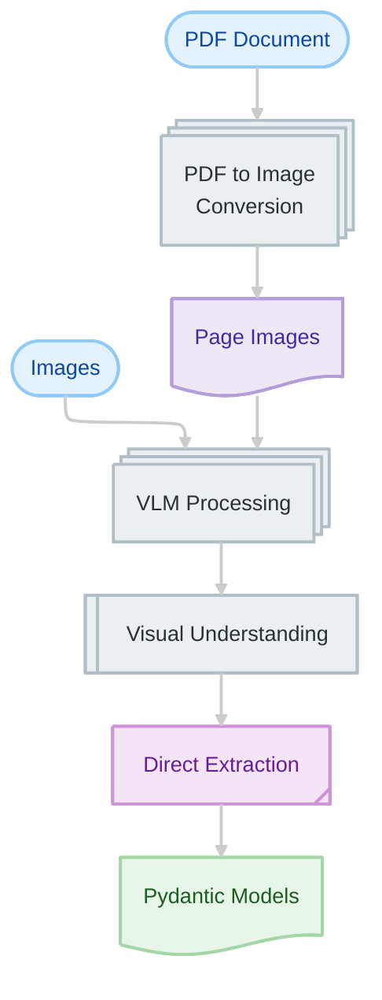

```mermaid
%%{init: {'theme': 'redux-dark', 'look': 'default', 'layout': 'elk'}}%%
flowchart TD
    %% 1. Define Classes
    classDef input fill:#E3F2FD,stroke:#90CAF9,color:#0D47A1
    classDef config fill:#FFF8E1,stroke:#FFECB3,color:#5D4037
    classDef output fill:#E8F5E9,stroke:#A5D6A7,color:#1B5E20
    classDef decision fill:#FFE0B2,stroke:#FFB74D,color:#E65100
    classDef data fill:#EDE7F6,stroke:#B39DDB,color:#4527A0
    classDef operator fill:#F3E5F5,stroke:#CE93D8,color:#6A1B9A
    classDef process fill:#ECEFF1,stroke:#B0BEC5,color:#263238

    %% 2. Define Nodes
    InputPDF@{ shape: terminal, label: "PDF Document" }
    InputImg@{ shape: terminal, label: "Images" }
    
    Convert@{ shape: procs, label: "PDF to Image<br>Conversion" }
    PageImgs@{ shape: doc, label: "Page Images" }
    
    VLM@{ shape: procs, label: "VLM Processing" }
    Understand@{ shape: lin-proc, label: "Visual Understanding" }
    Extract@{ shape: tag-proc, label: "Direct Extraction" }
    
    Output@{ shape: doc, label: "Pydantic Models" }

    %% 3. Define Connections
    %% Path A: PDF requires conversion
    InputPDF --> Convert
    Convert --> PageImgs
    PageImgs --> VLM
    
    %% Path B: Direct Image Input (Merges here)
    InputImg --> VLM
    
    %% Shared Processing Chain
    VLM --> Understand
    Understand --> Extract
    Extract --> Output

    %% 4. Apply Classes
    class InputPDF,InputImg input
    class Convert,VLM,Understand process
    class PageImgs data
    class Extract operator
    class Output output
```