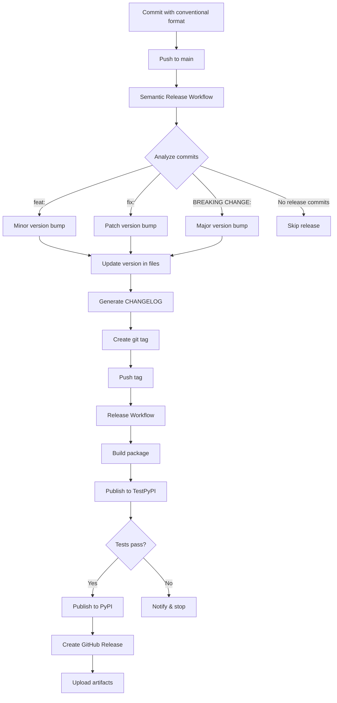

# Release Process

This document describes the automated release process for Docling Graph.

## Overview

Docling Graph uses a fully automated release process powered by:

- **Python Semantic Release** - Automatic version bumping and changelog generation
- **GitHub Actions** - Automated testing, building, and publishing
- **Conventional Commits** - Standardized commit messages for version determination

## Release Workflow



## Conventional Commits

### Commit Format

```
<type>(<scope>): <subject>

<body>

<footer>
```

### Commit Types

| Type | Description | Version Bump | Example |
|------|-------------|--------------|---------|
| `feat` | New feature | Minor (0.x.0) | `feat: add PDF batch processing` |
| `fix` | Bug fix | Patch (0.0.x) | `fix: resolve memory leak in chunker` |
| `perf` | Performance improvement | Patch (0.0.x) | `perf: optimize graph construction` |
| `docs` | Documentation only | None | `docs: update installation guide` |
| `style` | Code style changes | None | `style: format with ruff` |
| `refactor` | Code refactoring | None | `refactor: simplify config loading` |
| `test` | Test additions/changes | None | `test: add integration tests` |
| `chore` | Maintenance tasks | None | `chore: update dependencies` |
| `ci` | CI/CD changes | None | `ci: add caching to workflows` |

### Breaking Changes

To trigger a major version bump (x.0.0), include `BREAKING CHANGE:` in the commit footer:

```
feat: redesign configuration API

BREAKING CHANGE: Configuration now uses PipelineConfig instead of dict.
Migration guide available in docs/migration.md
```

Or use `!` after the type:

```
feat!: redesign configuration API
```

## Making a Release

### Automatic Release (Recommended)

1. **Make changes and commit with conventional format:**

```bash
git checkout -b feature/my-feature
# Make changes
git add .
git commit -s -m "feat: add new extraction strategy"
git push origin feature/my-feature
```

2. **Create and merge PR:**

```bash
# Create PR on GitHub
# Wait for CI checks to pass
# Merge to main
```

3. **Automatic release happens:**

- Semantic Release workflow analyzes commits
- Determines version bump (if needed)
- Updates version in `pyproject.toml` and `__init__.py`
- Generates CHANGELOG entry
- Creates and pushes git tag
- Release workflow triggers automatically
- Package published to TestPyPI, then PyPI
- GitHub Release created with artifacts

### Manual Release (Emergency)

If you need to create a release manually:

```bash
# 1. Update version manually
# Edit pyproject.toml and docling_graph/__init__.py

# 2. Update CHANGELOG.md
# Add entry for new version

# 3. Commit changes
git add .
git commit -s -m "chore(release): 0.3.0"
git push

# 4. Create and push tag
git tag v0.3.0
git push origin v0.3.0

# Release workflow will trigger automatically
```

## Release Stages

### Stage 1: Semantic Release

**Workflow**: `.github/workflows/semantic-release.yml`

**Triggers**: Push to main branch

**Actions**:
1. Analyzes commits since last release
2. Determines version bump (major/minor/patch)
3. Updates version in files
4. Generates CHANGELOG entry
5. Creates git commit and tag
6. Pushes changes

**Skip conditions**:
- No conventional commits found
- Only non-release commits (docs, chore, etc.)

### Stage 2: TestPyPI Publishing

**Workflow**: `.github/workflows/release.yml` (job: test-build)

**Triggers**: Git tag push (v*.*.*)

**Actions**:
1. Builds distribution packages
2. Publishes to TestPyPI
3. Tests installation from TestPyPI
4. Uploads artifacts for next stage

**Purpose**: Catch issues before production release

### Stage 3: PyPI Publishing

**Workflow**: `.github/workflows/release.yml` (job: publish-pypi)

**Triggers**: Successful TestPyPI stage

**Actions**:
1. Downloads build artifacts
2. Publishes to production PyPI

**Requirements**:
- TestPyPI tests passed
- OIDC trusted publishing configured

### Stage 4: GitHub Release

**Workflow**: `.github/workflows/release.yml` (job: create-release)

**Triggers**: Successful PyPI publishing

**Actions**:
1. Extracts release notes from CHANGELOG
2. Creates GitHub Release
3. Uploads distribution artifacts
4. Generates summary

## Configuration

### PyPI Trusted Publishing

Configure OIDC trusted publishing (no API tokens needed):

1. **For PyPI:**
   - Go to https://pypi.org/manage/account/publishing/
   - Add GitHub as trusted publisher
   - Repository: `IBM/docling-graph`
   - Workflow: `release.yml`
   - Environment: `pypi`

2. **For TestPyPI:**
   - Go to https://test.pypi.org/manage/account/publishing/
   - Add GitHub as trusted publisher
   - Repository: `IBM/docling-graph`
   - Workflow: `release.yml`
   - Environment: `testpypi`

### GitHub Environments

Create environments in repository settings:

1. **pypi** environment:
   - Protection rules: Require approval (optional)
   - Deployment branches: Only `main`

2. **testpypi** environment:
   - No special protection needed

### Branch Protection

Configure branch protection for `main`:

- Require pull request reviews
- Require status checks to pass
- Require branches to be up to date
- Include administrators

## Versioning Strategy

Docling Graph follows [Semantic Versioning 2.0.0](https://semver.org/):

- **Major (x.0.0)**: Breaking changes
- **Minor (0.x.0)**: New features (backward compatible)
- **Patch (0.0.x)**: Bug fixes (backward compatible)

### Version Examples

```
0.1.0 → 0.2.0  (feat: new feature)
0.2.0 → 0.2.1  (fix: bug fix)
0.2.1 → 1.0.0  (BREAKING CHANGE: API redesign)
```

## Troubleshooting

### No Release Created

**Symptom**: Semantic Release workflow runs but no release is created

**Causes**:
- No conventional commits since last release
- Only non-release commits (docs, chore, etc.)

**Solution**: Check commit messages follow conventional format

### TestPyPI Publish Fails

**Symptom**: TestPyPI publishing fails

**Common causes**:
1. Version already exists on TestPyPI
2. OIDC not configured
3. Package name conflict

**Solutions**:
```bash
# Check if version exists
pip index versions -i https://test.pypi.org/simple/ docling-graph

# Verify OIDC configuration in TestPyPI settings
```

### PyPI Publish Fails

**Symptom**: PyPI publishing fails after TestPyPI success

**Common causes**:
1. OIDC not configured for PyPI
2. Version already exists
3. Package validation errors

**Solutions**:
- Verify OIDC configuration
- Check PyPI project settings
- Review package metadata

### GitHub Release Fails

**Symptom**: Release created but GitHub Release fails

**Common causes**:
1. Insufficient permissions
2. Tag already has a release
3. CHANGELOG format issues

**Solutions**:
```bash
# Check permissions
# Verify GITHUB_TOKEN has write access

# Check existing releases
gh release list

# Validate CHANGELOG format
```

## Best Practices

### 1. Write Good Commit Messages

```bash
# Good
feat(cli): add batch processing command
fix(extractor): resolve memory leak in chunker
docs: update installation guide

# Bad
update code
fix bug
changes
```

### 2. Use Scopes

Scopes help organize changes:

```bash
feat(cli): ...
fix(core): ...
docs(api): ...
test(integration): ...
```

### 3. Test Before Merging

```bash
# Run tests locally
uv run pytest

# Run pre-commit checks
uv run pre-commit run --all-files

# Test build
uv build
```

### 4. Review CHANGELOG

After release, verify CHANGELOG.md:

- Version number correct
- Release date accurate
- Changes properly categorized
- Breaking changes highlighted

### 5. Monitor Releases

- Check GitHub Actions for workflow status
- Verify package on PyPI
- Test installation: `pip install docling-graph==x.y.z`
- Review GitHub Release notes

## Release Checklist

Before merging to main:

- [ ] All tests pass
- [ ] Pre-commit checks pass
- [ ] Commit messages follow conventional format
- [ ] Breaking changes documented
- [ ] Migration guide created (if needed)
- [ ] Examples updated
- [ ] Documentation updated

After release:

- [ ] Verify package on PyPI
- [ ] Test installation
- [ ] Check GitHub Release
- [ ] Review CHANGELOG
- [ ] Announce release (if major/minor)

## Emergency Procedures

### Rollback a Release

If a critical issue is found:

1. **Yank the release from PyPI:**

```bash
# Requires PyPI credentials
pip install twine
twine upload --repository pypi --skip-existing dist/*
```

2. **Create hotfix:**

```bash
git checkout -b hotfix/critical-fix
# Fix the issue
git commit -s -m "fix: critical issue description"
# Create PR and merge
```

3. **New release will be created automatically**

### Skip CI for Commits

To skip CI workflows:

```bash
git commit -m "docs: update README [skip ci]"
```

## Resources

- [Semantic Versioning](https://semver.org/)
- [Conventional Commits](https://www.conventionalcommits.org/)
- [Python Semantic Release](https://python-semantic-release.readthedocs.io/)
- [PyPI Trusted Publishing](https://docs.pypi.org/trusted-publishers/)
- [GitHub Actions](https://docs.github.com/en/actions)